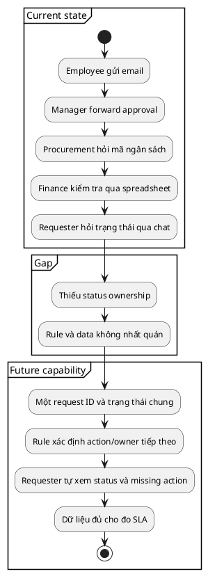

# Current State và Future State Analysis cho BA

> Note này giúp BA mô tả cách công việc đang vận hành, trạng thái mong muốn và
> gap cần xử lý mà chưa nhảy thẳng vào thiết kế hệ thống.

## Note này dùng để làm gì

Mở note khi cần thống nhất “đang xảy ra gì”, tìm gap hoặc chuẩn bị đánh giá
solution option. Nếu problem chưa rõ, đọc [[problem-framing-and-business-objectives]].

## 1. Sáu lens của current state

| Lens | Câu hỏi |
|---|---|
| People | ai làm, quyết định, chịu impact? |
| Process | trigger, step, handoff, exception, end state? |
| Information | dữ liệu/artifact nào được tạo, dùng, mất? |
| Technology | hệ thống/tool nào hỗ trợ hoặc cản trở? |
| Policy/rule | rule nào có authority, rule nào chỉ là thói quen? |
| Performance | volume, wait time, error/rework và baseline? |

Evidence nên kết hợp observation, artifact/log và interview. Quy trình được kể
không mặc định là quy trình thật.

## 2. Future state mô tả capability và outcome

Future state không đồng nghĩa “xây portal”. Capability “một nguồn trạng thái có
owner” có thể được đáp ứng bằng thay đổi process, cấu hình tool hiện có hoặc xây
mới. Giữ solution space mở tới option analysis.

## 3. Gap classification

| Gap | Ví dụ | Handoff thường gặp |
|---|---|---|
| Capability | requester không tự theo dõi | solution option/use case |
| Process | handoff không owner/SLA | process modeling |
| Data | thiếu budget code chuẩn | data model/dictionary |
| Skill/role | approver không biết rule | training/RACI |
| Policy | exception chưa có authority | policy decision |
| Technology | tool không lưu transition | integration/solution analysis |

Gap phải trace về evidence và objective. “Chưa có mobile app” không phải gap nếu
không chứng minh capability/outcome bị thiếu.

## 4. Running case và transition need

- **Current fact:** 6/10 sample thiếu budget code ở submission đầu.
- **Future capability:** submission không vào approval queue nếu thiếu required data.
- **Gap:** data validation và owner của budget code chưa rõ.
- **Transition need:** map request đang mở sang ID mới và train Procurement.
- **Constraint:** authentication bằng corporate identity.
- **Open question:** request cũ có cần migrate attachment không?

## 5. Anti-patterns

| Anti-pattern | Cách sửa |
|---|---|
| current state chỉ có happy path | lấy exception/rework và observed workaround |
| future state là list màn hình | viết capability/outcome trước |
| vẽ process không có baseline | gắn volume/time/error source |
| mọi difference đều thành gap | trace về objective và impact |
| bỏ transition | ghi migration, training, rollout need |

## 6. Checklist nhanh

- Current state có evidence trên sáu lens không?
- Flow được kể và flow quan sát có khác nhau không?
- Future state mô tả capability thay vì feature không?
- Mỗi gap có evidence, impact và owner không?
- Constraint/assumption/transition need đã tách chưa?
- Output đã đủ cho option analysis chưa?

## References

- [IIBA — BABOK Guide](https://www.iiba.org/career-resources/a-business-analysis-professionals-foundation-for-success/babok/) — current state, future state, gap/risk trong Strategy Analysis.

## Related

- [[problem-framing-and-business-objectives|Problem Framing & Business Objectives]]
- [[stakeholder-analysis-and-engagement|Stakeholder Analysis & Engagement]]
- [[scope-assumptions-constraints|Scope, Assumptions & Constraints]]
- [[solution-options-and-business-case|Solution Options & Business Case]]
