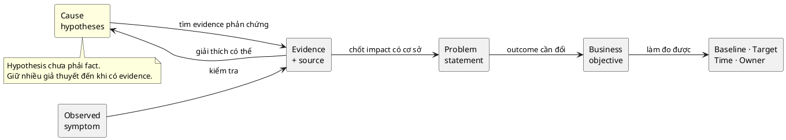

# Problem Framing và Business Objectives cho BA

> Note này giúp BA đi từ symptom hoặc feature request tới problem statement và
> objective có thể đo. Mục tiêu là điều tra đúng bài toán trước khi đặc tả một
> solution rất chi tiết nhưng không tạo outcome.

## Note này dùng để làm gì

Mở note khi stakeholder bắt đầu bằng “hãy làm tính năng X”, các bên mô tả vấn đề
khác nhau, hoặc project chưa có tiêu chí thành công. Đọc tiếp
[[current-state-and-future-state-analysis|Current/Future State]] và
[[scope-assumptions-constraints|Scope, Assumptions & Constraints]].

## 1. Tách sáu lớp thông tin

| Lớp | Ý nghĩa | Ví dụ |
|---|---|---|
| Symptom | dấu hiệu quan sát được | nhân viên hỏi trạng thái nhiều lần |
| Evidence | dữ liệu/quan sát có nguồn | 18/50 yêu cầu phải hỏi lại trong mẫu tháng trước |
| Cause hypothesis | nguyên nhân có thể, chưa chắc đúng | email phân tán làm mất visibility |
| Problem statement | ai gặp vấn đề gì, trong context nào, impact gì | người gửi không biết yêu cầu đang ở bước nào nên làm gián đoạn Procurement |
| Objective | thay đổi mong muốn ở outcome | giảm yêu cầu phải hỏi lại trạng thái |
| Solution idea | một cách có thể giải quyết | dashboard theo dõi |

Flow có vòng phản chứng: đừng chạy 5 Whys rồi tuyên bố câu trả lời cuối là root
cause. Kết quả của phân tích nguyên nhân ban đầu vẫn là hypothesis cho tới khi có
evidence đủ mạnh.

## 2. Viết problem statement

Một problem statement hữu ích trả lời:

> **[Actor]** trong **[context]** gặp **[vấn đề quan sát được]**, dẫn tới
> **[impact có evidence]**. Hiện chưa chắc **[cause hypothesis/open question]**.

Ví dụ:

> Nhân viên gửi yêu cầu mua thiết bị qua email không biết yêu cầu đang ở bước nào
> hoặc ai cần hành động. Trong mẫu 50 yêu cầu tháng trước, 18 yêu cầu phát sinh ít
> nhất một lượt hỏi trạng thái, làm ngắt việc của Procurement. Cần xác minh nguyên
> nhân chính là thiếu dữ liệu trạng thái hay SLA phê duyệt không rõ.

Statement này không chứa “xây dashboard”. Nó để nhiều option còn mở.

## 3. Objective phải có cách nhận biết thành công

| Thành phần | Câu hỏi |
|---|---|
| Baseline | hiện tại metric là bao nhiêu, đo từ đâu? |
| Target | mức thay đổi nào đủ tạo giá trị? |
| Time horizon | khi nào đánh giá? |
| Segment/context | áp dụng cho ai, loại case nào? |
| Owner | ai chịu trách nhiệm outcome và chấp nhận trade-off? |

Ví dụ objective giả định: “Trong 8 tuần sau rollout, giảm tỷ lệ yêu cầu mua thiết
bị phải hỏi trạng thái từ baseline 36% xuống dưới 10%, đo trên ticket đã đóng,
owner là Head of Procurement.” Target này cần stakeholder xác nhận; nó không tự
động trở thành fact chỉ vì được viết cụ thể.

## 4. Khi dùng công cụ tìm nguyên nhân

- **5 Whys:** nhanh để mở rộng probing; không chứng minh causal chain.
- **Cause map/fishbone:** giữ nhiều nhóm hypothesis; dễ thành brainstorming thiếu evidence.
- **Process/data analysis:** tốt khi có event/log; không cho biết đầy đủ động cơ con người.
- **Interview/observation:** cho context; dễ chịu recall/observer bias.

Kết hợp ít nhất hai loại evidence khi quyết định nguyên nhân ảnh hưởng scope lớn.

### Running case: ShopFlow

**Từ symptom tới objective — ShopFlow `SF-1`:**

| Lớp (§1) | ShopFlow |
|---|---|
| Symptom | chủ shop than "mỗi lần có khách order là phải chạy ra kho đếm, có lúc đếm xong khách hủy vì lâu quá" |
| Evidence | 3 lần/tháng order vượt stock; mỗi lần mất ~15 phút gọi điện xin lỗi khách; 1 khách cancel trung bình mỗi lần (nguồn: sổ ghi chép + interview chủ shop) |
| Cause hypothesis | (1) không biết stock thực tế lúc nhận order; (2) khách không thấy sản phẩm còn/hết nên order mù; (3) quy trình ghi sổ chậm hơn tốc độ bán |
| Problem statement | **Chủ shop** trong **giờ bán hàng (9h–18h)** gặp **tình trạng không biết chính xác tồn kho thực tế khi khách đặt hàng**, dẫn tới **nhận order vượt stock, mất thời gian gọi xin lỗi và mất khách (3 lần/tháng, ~45 phút/tháng)**. Cần xác minh hypothesis (2) là phụ hay cũng là nguyên nhân chính. |
| Objective | giảm số lần order vượt stock từ baseline 3 lần/tháng xuống 0 lần/tháng (**target**), đo trong 8 tuần sau rollout (**time**), owner là chủ shop |
| Solution idea | hệ thống online có catalog real-time + stock validation (8 story `SF-2..SF-9`) |

**Áp §2 — Problem statement của từng story chính:**

| Story | Problem statement |
|---|---|
| `SF-3` Create Order | Khách hàng không biết sản phẩm còn/hết trước khi đặt, dẫn tới order bị reject sau khi đã mất thời gian chọn món |
| `SF-6` Manage Stock | Nhân viên kho không có một nguồn số liệu stock duy nhất; sổ giấy và thực tế lệch nhau sau mỗi đợt nhập hàng |
| `SF-5` Delivery Status | Khách hàng phải gọi điện hỏi "đơn tới đâu" vì không có kênh tự tra cứu; mỗi ngày 2-3 cuộc gọi làm gián đoạn chủ shop |

**Checklist §6 kiểm chứng:** cả 3 problem statement đều không chứa "xây màn hình X" — chúng mô tả actor + context + impact + evidence, giữ solution space mở cho team chọn cách giải.

## 5. Anti-patterns

| Anti-pattern | Cách sửa |
|---|---|
| problem statement là “chưa có dashboard” | mô tả actor, context, impact trước solution |
| objective là “triển khai hệ thống” | chuyển output thành outcome đo được |
| KPI có target nhưng không baseline/source | định nghĩa cách đo trước khi cam kết |
| một lời phàn nàn đại diện mọi user | kiểm tra prevalence và segment |
| root cause được chốt trong workshop | giữ nhãn hypothesis và kế hoạch kiểm chứng |

## 6. Checklist nhanh

- Symptom có evidence và source không?
- Cause nào là fact, cause nào mới là hypothesis?
- Problem có actor, context và impact không?
- Objective mô tả outcome thay vì feature không?
- Baseline, target, thời hạn và owner đã rõ chưa?
- Solution space còn ít nhất hai option khả dĩ không?

## References

- [IIBA — BABOK Guide](https://www.iiba.org/career-resources/a-business-analysis-professionals-foundation-for-success/babok/) — nền tham chiếu cho Strategy Analysis và đánh giá business need.
- [UK Government Service Manual — Discovery phase](https://www.gov.uk/service-manual/agile-delivery/how-the-discovery-phase-works) — cách discovery tập trung vào problem, user và constraint trước khi xây solution.

## Related

- [[requirement-elicitation|Requirement Elicitation]]
- [[current-state-and-future-state-analysis|Current & Future State Analysis]]
- [[solution-options-and-business-case|Solution Options & Business Case]]
- [[scope-assumptions-constraints|Scope, Assumptions & Constraints]]

