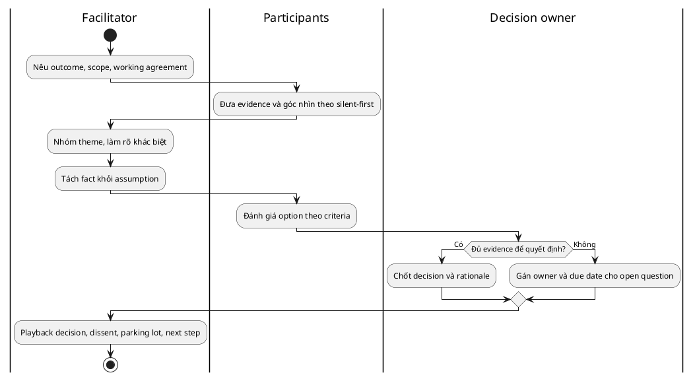

# Requirements Workshop cho BA

> Note này giúp BA thiết kế workshop tạo shared understanding hoặc decision.
> Workshop không phải meeting đông người: nó cần outcome, facilitation flow,
> decision authority và follow-up rõ.

## Note này dùng để làm gì

Mở note khi nhiều stakeholder cần dựng chung process/rule, giải quyết khác biệt
hoặc chốt decision. Không dùng workshop để buộc người yếu quyền nói về chủ đề
nhạy cảm trước approver.

## 1. Khi nào dùng và không dùng

| Dùng khi | Không dùng trước khi |
|---|---|
| cần nhiều góc nhìn trên cùng model | chưa xử lý conflict nhạy cảm bằng 1:1 |
| cần alignment hoặc decision | chưa có decision owner/criteria |
| dependency cần lộ ra | participant chưa có context/pre-read |
| cần tạo artifact chung nhanh | mục tiêu chỉ là cập nhật status |

Weakness: groupthink, authority bias, dominant voice và quyết định giả khi người
có thẩm quyền vắng mặt.

## 2. Workshop contract

Chốt trước khi mời lịch:

- **Outcome:** artifact/decision nào phải có khi kết thúc?
- **Scope:** câu hỏi nào xử lý và không xử lý?
- **Roles:** facilitator, participant, decision owner, scribe, timekeeper.
- **Input:** evidence, current model, option và criteria.
- **Capture:** decision, dissent, assumption, dependency, open question.

Không đủ evidence là output hợp lệ nếu gap có owner. Ép vote chỉ để có decision
sẽ giấu risk.

## 3. Agenda 90 phút mẫu

1. 0–10: outcome, boundary, working agreement.
2. 10–25: silent review evidence/as-is flow.
3. 25–45: từng role bổ sung exception và concern.
4. 45–60: cluster conflict; tách fact/assumption/policy.
5. 60–75: đánh giá option theo criteria.
6. 75–85: decision owner chốt hoặc giao validation action.
7. 85–90: playback owner/date và parking lot.

Silent-first giảm anchoring vào người nói đầu. Round-robin hữu ích nhưng không
được ép participant tiết lộ điều nhạy cảm.

## 4. Running case

Manager nghĩ mọi request phải qua họ; Finance nói request dưới 5 triệu có thể
auto-check budget.

- **Fact:** policy FIN-04 có threshold 5 triệu, Finance sở hữu policy.
- **Assumption:** bỏ Manager dưới threshold không ảnh hưởng accountability.
- **Open question:** Manager owner xác nhận delegation rule.
- **Decision:** chưa chốt future flow; timebox validation 3 ngày thay vì vote.
- **Dissent:** Procurement lo exception mua thiết bị đặc thù chưa được bao phủ.

## 5. Xử lý dynamics

| Tình huống | Intervention |
|---|---|
| một người nói liên tục | silent writing, round-robin, timebox |
| im lặng vì quyền lực | collect riêng/anonymous, split session |
| tranh luận opinion | quay về evidence và criteria |
| lan scope | parking lot có owner/date |
| thiếu authority | tạo recommendation và approval path |

## 6. Anti-patterns

| Anti-pattern | Cách sửa |
|---|---|
| agenda chỉ là topic | viết outcome/artifact cho từng block |
| facilitator bảo vệ solution | tách role hoặc công khai bias |
| vote thay evidence/authority | dùng criteria và decision owner |
| bỏ dissent | lưu rationale và residual risk |
| parking lot không owner | gắn owner, due date, disposition |

## 7. Checklist nhanh

- Workshop có tốt hơn interview/async review không?
- Outcome, boundary và decision owner rõ chưa?
- Participant có đủ evidence/impact/authority không?
- Agenda có divergence và convergence không?
- Power dynamic được xử lý bằng format nào?
- Decision/dissent/open question có owner không?
- Summary đã playback trước khi kết thúc chưa?

## References

- [IIBA — BABOK Guide](https://www.iiba.org/career-resources/a-business-analysis-professionals-foundation-for-success/babok/) — workshop/facilitation trong elicitation and collaboration.

## Related

- [[requirement-elicitation|Requirement Elicitation]]
- [[elicitation-technique-selection|Elicitation Technique Selection]]
- [[stakeholder-analysis-and-engagement|Stakeholder Analysis & Engagement]]
- [[scope-assumptions-constraints|Scope, Assumptions & Constraints]]

