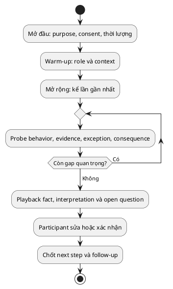

# Stakeholder Interview cho BA

> Note này giúp BA thực hiện interview tạo evidence, không chỉ đọc một danh sách
> câu hỏi. Interview hợp để hiểu context, example và chủ đề khó nói trước nhóm;
> nó không tự chứng minh mức độ phổ biến của vấn đề.

## Note này dùng để làm gì

Mở note khi cần khai thác workflow, pain point, rule hoặc exception từ một
stakeholder. Cần có objective và participant rationale trước khi đặt lịch.

## 1. Khi nào dùng và không dùng

| Dùng khi | Không dùng một mình khi |
|---|---|
| cần context/experience cá nhân | cần quan sát thao tác thực tế |
| topic nhạy cảm hoặc có power imbalance | cần ra decision nhiều bên ngay |
| cần probe example và exception | cần đo prevalence trên population |
| SME khó cùng lịch | source of truth là policy/log có thể kiểm tra |

Weakness chính: recall bias, social desirability, leading question và
interpretation của interviewer. Bù bằng artifact/log, observation và playback.

## 2. Chuẩn bị interview package

- research objective và 3–5 unknown quan trọng;
- participant rationale: người này có evidence gì;
- consent, recording, confidentiality và cách dùng dữ liệu;
- question guide theo topic, không phải script cứng;
- note-taking role, nơi lưu evidence và cách follow-up.

Funnel mở rộng trước để tránh áp framing, rồi hẹp dần vào evidence và xác nhận.

## 3. Câu hỏi tốt bám behavior

| Tránh | Hỏi lại |
|---|---|
| “Anh thấy quy trình chậm không?” | “Lần gần nhất anh gửi yêu cầu là khi nào? Mỗi bước mất bao lâu?” |
| “Dashboard giải quyết được không?” | “Khi cần biết trạng thái, anh làm gì? Điều gì xảy ra tiếp?” |
| “Finance luôn duyệt sau Manager?” | “Ai duyệt trong ba case gần nhất? Có exception nào?” |
| “Anh muốn notification thế nào?” | “Thông tin nào giúp anh hành động, ở thời điểm nào?” |

Probe bằng “ví dụ gần nhất”, “điều gì xảy ra nếu”, “dựa vào đâu để quyết định”
và “trường hợp nào không theo flow”.

## 4. Ghi note có provenance

| Quote/observation | Interpretation | Assumption | Follow-up |
|---|---|---|---|
| “Tôi thường hỏi Finance qua chat” | handoff thiếu visibility | chat là kênh duy nhất | kiểm sample artifact có consent |

Quote là evidence participant đã nói câu đó, chưa phải fact của toàn population.

Running case sau synthesis:

- **Fact:** 6/10 case participant cung cấp thiếu mã ngân sách ở email đầu.
- **Pain point:** Procurement phải hỏi lại; requester không biết đang chờ mình.
- **Requirement candidate:** requester xem được action còn thiếu và owner hiện tại.
- **Solution idea:** notification tự động sau 24 giờ.
- **Assumption:** timestamp email phản ánh đúng thời gian vào queue.
- **Open question:** Finance xác nhận lúc request chính thức vào queue.

## 5. Anti-patterns

| Anti-pattern | Cách sửa |
|---|---|
| hỏi opinion chung chung | yêu cầu example gần nhất và artifact |
| đọc script, không probe | giữ objective, linh hoạt theo evidence |
| mọi câu nói thành requirement | phân loại quote/fact/need/idea |
| không nói cách dùng recording | xin consent và nêu retention/access |
| gửi raw transcript để confirm | gửi synthesis ngắn, đánh dấu điểm cần sửa |

## 6. Checklist nhanh

- Objective/unknown và participant rationale đã rõ chưa?
- Đã xử lý consent/confidentiality chưa?
- Câu hỏi có neutral và bám behavior không?
- Đã hỏi exception, consequence và source chưa?
- Fact, interpretation và assumption có tách không?
- Playback/follow-up có owner không?

## References

- [IIBA — BABOK Guide](https://www.iiba.org/career-resources/a-business-analysis-professionals-foundation-for-success/babok/) — interview trong elicitation and collaboration.
- [UK Government Service Manual — User research](https://www.gov.uk/service-manual/user-research) — nguyên tắc làm việc với participant và evidence hành vi.

## Related

- [[requirement-elicitation|Requirement Elicitation]]
- [[elicitation-technique-selection|Elicitation Technique Selection]]
- [[stakeholder-analysis-and-engagement|Stakeholder Analysis & Engagement]]
- [[requirement-quality-and-validation|Requirement Quality & Validation]]

