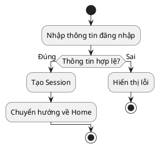
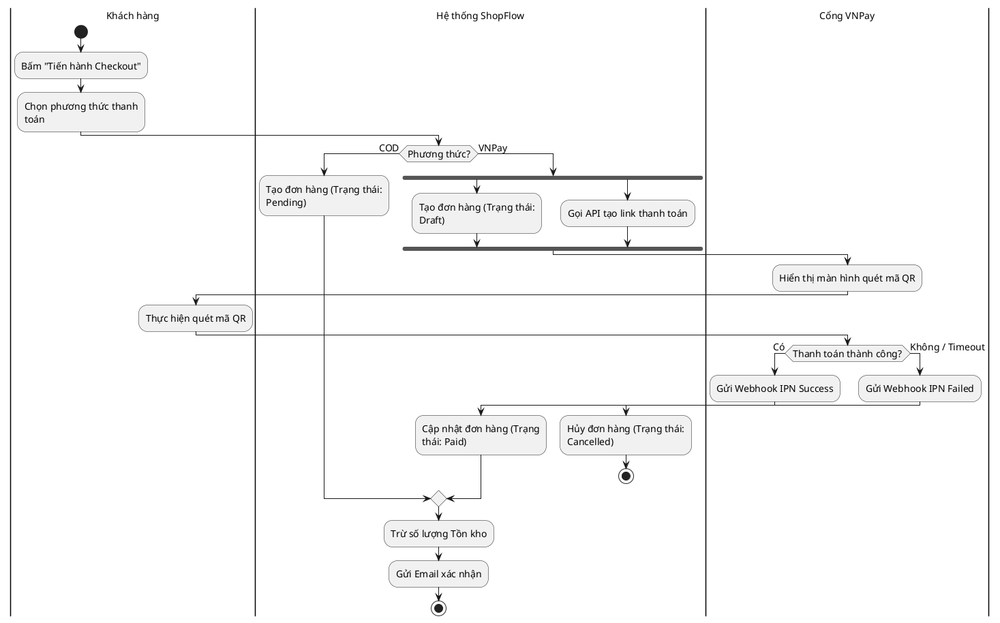

# Activity Diagram cho BA

> Note này hướng dẫn cách vẽ UML Activity Diagram để mô tả luồng (flow) của một Use Case. Nó trả lời câu hỏi: "Để đạt được mục tiêu, hệ thống và người dùng phải đi qua những bước nào, rẽ nhánh ra sao?"

## Note này dùng để làm gì

Mở note khi bạn đã có **Use Case** (VD: Khách hàng đặt hàng) nhưng Dev hỏi: "Luồng chạy như thế nào? Xảy ra lỗi ở bước 2 thì đi về đâu?". 
Activity Diagram mạnh hơn Flowchart (lưu đồ thuật toán) ở chỗ nó hỗ trợ **Swimlanes** (chia làn) và **Concurrency** (chạy song song).

## 1. Các thành phần cơ bản (Basic Notation)

Trước khi vào sơ đồ phức tạp, hãy nhìn cấu trúc cơ bản của một luồng nghiệp vụ.

**Giải nghĩa:**
*   **Điểm bắt đầu (Initial Node):** Vòng tròn đen đặc (`start`). Chỉ có 1 điểm bắt đầu.
*   **Hành động (Action):** Hình chữ nhật bo góc (`:Tên hành động;`).
*   **Rẽ nhánh (Decision / Merge):** Hình thoi (`if/else`). Chỉ có 1 đường vào nhưng nhiều đường ra, và chỉ 1 đường ra được đi tiếp.
*   **Điểm kết thúc (Final Node):** Vòng tròn đen có viền ngoài (`stop`). Có thể có nhiều điểm kết thúc.

## 2. Activity Diagram với Swimlane & Chạy song song (ShopFlow Case Study)

Dưới đây là một sơ đồ thực tế cho Use Case **SF-3: Đặt hàng và Thanh toán** của ShopFlow. Sơ đồ này dùng **Swimlanes** (Làn) để phân rõ trách nhiệm ai làm việc gì, và **Fork/Join** để xử lý song song.

**Các khái niệm nâng cao trong sơ đồ trên:**
*   **Swimlanes (Làn bơi):** Chia theo Actor (`|Khách hàng|`, `|Hệ thống|`). Giúp dev biết API nào gọi ở Front-end, API nào xử lý ở Back-end.
*   **Fork (Chia luồng song song):** Thanh ngang mập chia 1 luồng thành 2 luồng chạy cùng lúc (Tạo đơn nháp VÀ Gọi API lấy link thanh toán cùng lúc).
*   **Join (Gộp luồng):** Đợi tất cả các luồng song song chạy xong mới đi tiếp.

## 3. Khi nào dùng Activity Diagram vs BPMN?

Nhiều BA nhầm lẫn giữa UML Activity và BPMN (Business Process Model and Notation).
*   **Dùng UML Activity:** Khi bạn mô tả logic của **1 tính năng phần mềm** (như luồng Checkout ở trên). Trọng tâm là hệ thống.
*   **Dùng BPMN:** Khi bạn mô tả **quy trình kinh doanh của cả công ty**. (VD: Quy trình Nhập hàng vào kho, có liên quan đến Kế toán, Thủ kho, Máy in mã vạch, Xe tải...). Trọng tâm là con người và phòng ban.

## 4. Anti-patterns

| Anti-pattern | Vì sao nguy hiểm | Cách sửa |
|---|---|---|
| **Vẽ sơ đồ mạng nhện** | Khó đọc, rối mắt, dev không nắm được luồng chính | Tách các luồng phụ thành các biểu đồ nhỏ (Sub-activity) |
| **Thiếu Final Node** | Lỗi logic, dev không biết luồng đi về đâu, dễ gây treo hệ thống | Mọi luồng dù đúng hay sai đều phải kết thúc ở `stop` |
| **Lạm dụng Swimlane** | Rác sơ đồ, mất tập trung | Chỉ thêm làn cho những Actor có tương tác thực sự trong luồng |
| **Nhầm với BPMN** | Mô tả hành vi con người thay vì logic phần mềm | Tập trung vào hệ thống. Dùng BPMN cho luồng công việc tổ chức |

## 5. Checklist nhanh

Trước khi giao Activity Diagram cho Dev/QA, hãy kiểm tra:

- Sơ đồ có duy nhất 1 điểm bắt đầu (Initial Node) chưa?
- Mọi rẽ nhánh (Decision) đều có điều kiện rõ ràng (Guard condition) và phủ kín các trường hợp (Ví dụ: >0 và <=0) chưa?
- Luồng có rớt vào ngõ cụt không, hay tất cả đều dẫn đến Final Node?
- Các hành động song song (Fork) đã được gộp lại (Join) chưa?

---

## Mini-glossary

- **Activity Diagram:** biểu đồ hoạt động trong UML, dùng mô tả luồng điều khiển của một tính năng.
- **Swimlane:** làn bơi, giúp phân định rõ ai/bộ phận nào chịu trách nhiệm cho hành động nào.
- **Fork / Join:** kỹ thuật chia / gộp luồng chạy song song.
- **Guard condition:** điều kiện rẽ nhánh (thường đặt ở Decision node).

## References

- *OMG Unified Modeling Language (UML) Specification v2.5.1*, Section 15 (Activities).
- *BABOK Guide v3*, Section 10.35 (Process Modeling).

## Internal Sources

- [[collections/modeling-and-flow/009 BA-38-UML-AD.pdf|UML Activity sample]]
- [[mapping/README|Study Map & Source Mapping]]

## Related

- Nguồn gốc luồng: [[use-case-diagram|Use Case Diagram]]
- Phân tích tương tác sâu: [[sequence-diagram|Sequence Diagram]]
- Mô hình quy trình tổ chức: [[business-process-modeling-bpmn|BPMN]]
