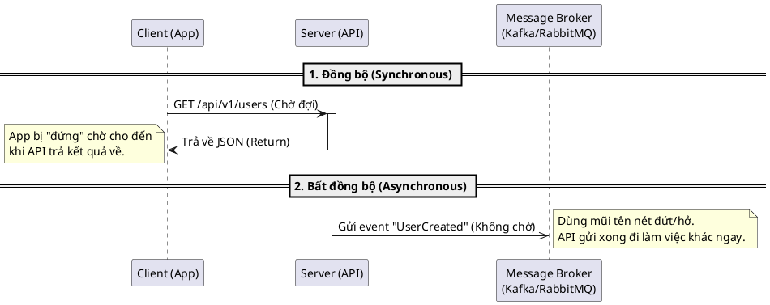
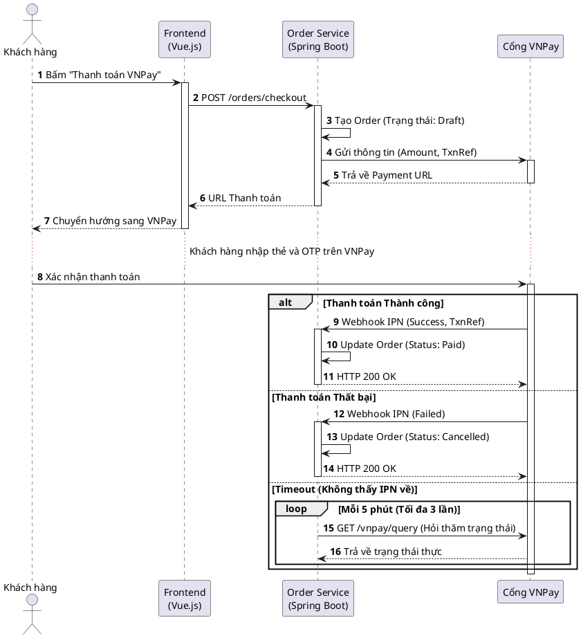

# Sequence Diagram (Biểu đồ Tuần tự)

> Note này hướng dẫn cách vẽ UML Sequence Diagram. Nó là bước zoom sâu nhất vào kỹ thuật, trả lời câu hỏi: "Các thành phần (Components) hoặc API gọi nhau theo trình tự thời gian nào, dữ liệu truyền đi là gì?"

## Note này dùng để làm gì

Khi bạn làm việc với Microservices, Tích hợp hệ thống bên thứ 3 (Payment, SMS, ERP), **Activity Diagram là không đủ**. Dev cần biết chính xác hệ thống A gọi hệ thống B đồng bộ hay bất đồng bộ, chuyện gì xảy ra nếu hệ thống B bị sập (timeout)? Đó là lúc BA vẽ Sequence Diagram.

## 1. Phân biệt Sync, Async và Return Message

Trước khi phân tích hệ thống lớn, hãy nắm chắc 3 nét vẽ cơ bản nhất của Sequence Diagram, đây là ngôn ngữ giao tiếp chính với Developer.

## 2. Sequence Diagram Tích hợp Hệ thống (ShopFlow Case Study)

Đây là sơ đồ phóng to vào bước **Thanh toán VNPay** trong dự án ShopFlow. Sơ đồ này sử dụng các khung logic (Fragments) như **alt** (if/else) và **loop** (vòng lặp) để xử lý các kịch bản lỗi.

**Giải nghĩa các Frame (Khung logic):**
*   **alt (Alternative):** Tương đương với lệnh If/Else/Else-if trong code.
*   **loop:** Vòng lặp. Rất quan trọng khi BA định nghĩa cơ chế Retry (thử lại) khi gọi API bên thứ 3 thất bại.
*   **opt (Optional):** Chỉ xảy ra nếu thỏa một điều kiện nào đó (If không có Else).

## 3. Anti-pattern (Lỗi sai phổ biến)

*   **Vẽ Sequence Diagram cho UI:** Mô tả Khách bấm nút A, màn hình chuyển sang màu X, hiện popup Y. *Sai hoàn toàn!* Đó là việc của Wireframe hoặc UI Flow. Sequence dùng để mô tả **Data / Tương tác ngầm**.
*   **Quên xử lý Timeout / Lỗi:** Chỉ vẽ đường Happy Path (Đường màu hồng). Nếu API thứ 3 chết thì hệ thống mình treo luôn? BA phải vẽ cả nhánh Else/Timeout để Dev xử lý.
*   **Code hóa sơ đồ:** Viết thẳng tên biến, tên hàm SQL (`SELECT * FROM...`) vào mũi tên. Hãy giữ nó ở mức Component/API Contract.

## 4. Checklist Review 

- [ ] Các mũi tên có phân biệt rõ Sync (Đồng bộ) và Async (Bất đồng bộ) không?
- [ ] Lời gọi API (Mũi tên đặc) đã có lời hồi đáp (Return - Mũi tên đứt) chưa?
- [ ] Các trường hợp hệ thống ngoài bị lỗi (Timeout, 500 Error) đã có nhánh `alt` xử lý chưa?
- [ ] Đã đánh số thứ tự (`autonumber`) để dễ thảo luận trong meeting chưa?

## 5. References

- *OMG Unified Modeling Language (UML) Specification v2.5.1*, Section 17 (Interactions).
- *BABOK Guide v3*, Section 10.41 (Sequence Diagrams).

## 6. Related

- Kịch bản tổng quan: [[use-case-diagram|Use Case Diagram]]
- Luồng rẽ nhánh: [[activity-diagram|Activity Diagram]]
- Tài liệu tích hợp: [[interface-and-integration-analysis|Interface Analysis]]
