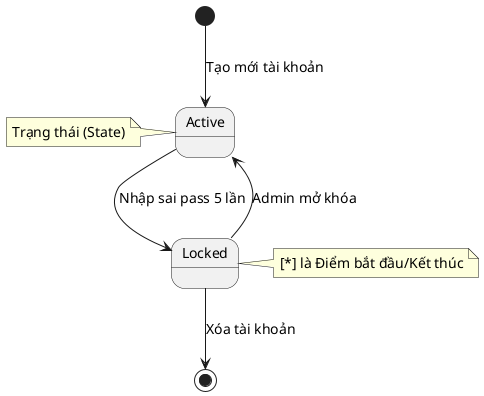
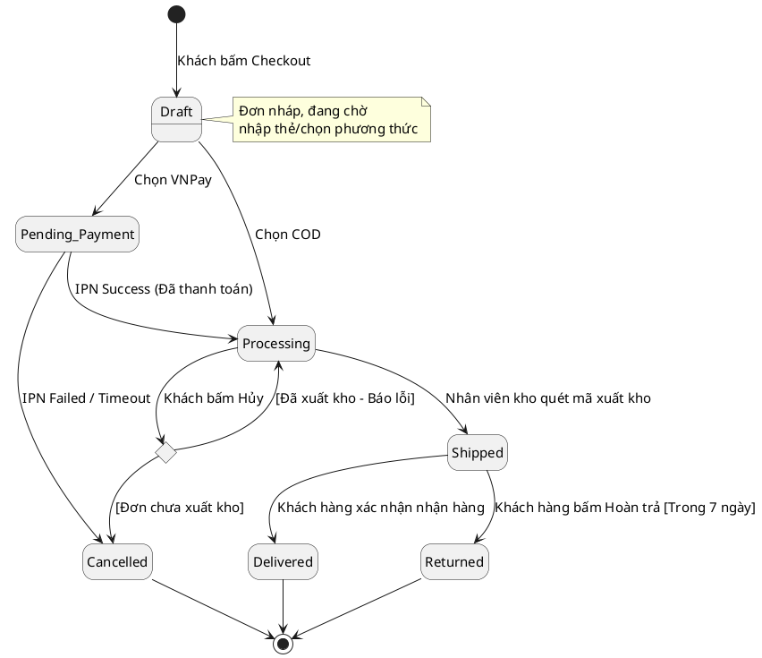

# State Diagram (Biểu đồ Trạng thái)

> Note này hướng dẫn vẽ UML State Machine Diagram. Nó trả lời câu hỏi: "Một thực thể (Entity) sinh ra như thế nào, sống qua những trạng thái nào, bị tác động bởi ai và chết đi ra sao?"

## Note này dùng để làm gì

Mở note khi bạn có một đối tượng dữ liệu phức tạp trong hệ thống. Ví dụ: Đơn hàng (Order), Tài khoản (Account), Yêu cầu nghỉ phép (Leave Request).
Nếu BA không vẽ sơ đồ này, Dev sẽ thả cửa cho phép cập nhật trạng thái "Đã giao hàng" thành "Đang chờ thanh toán" (điều vô lý trong logic kinh doanh).

## 1. Khái niệm cơ bản về Trạng thái và Chuyển tiếp

Một State Diagram không mô tả nhiều đối tượng (như Sequence), nó **chỉ mô tả DUY NHẤT một đối tượng**. 

**Công thức của một đường nối (Transition):**
`Trạng thái A` --(Sự kiện + Điều kiện bảo vệ)--> `Trạng thái B`

## 2. Vòng đời của Đơn hàng (ShopFlow Case Study)

Dưới đây là vòng đời hoàn chỉnh của một Thực thể **Order** trong hệ thống ShopFlow. Trạng thái của Order không thể nhảy lung tung mà bị khóa chặt bởi các sự kiện (Events).

**Giải nghĩa:**
*   **State (Trạng thái):** Hình chữ nhật bo tròn (Vd: `Pending_Payment`). Là tình trạng hiện tại của dữ liệu.
*   **Event (Sự kiện - Trigger):** Đoạn text trên mũi tên (Vd: `IPN Success`). Là hành động bóp cò làm thay đổi trạng thái.
*   **Guard Condition (Điều kiện bảo vệ):** Nằm trong ngoặc vuông `[ ]`. Sự kiện xảy ra nhưng phải thỏa điều kiện này mới được chuyển trạng thái. (Vd: Khách bấm hoàn trả nhưng phải `[Trong 7 ngày]`).
*   **Choice (Điểm rẽ nhánh):** Hình thoi (Như cái `CanCancel`). Dùng khi 1 sự kiện có thể dẫn ra 2 trạng thái khác nhau dựa vào điều kiện (Guard).

## 3. Lợi ích cực lớn của State Diagram cho Dev & QA

Khi BA bàn giao State Diagram này:
1. **Frontend Dev:** Sẽ biết khi đơn hàng ở `Shipped`, thì phải Ẩn nút "Hủy Đơn", chỉ hiện nút "Hoàn trả".
2. **Backend Dev:** Sẽ viết code chặn (Validation) API. Nếu ai đó cố tình bắn API đổi status từ `Draft` thẳng sang `Delivered`, hệ thống sẽ văng lỗi 400 Bad Request.
3. **QA/Tester:** Sẽ viết Test Case cho các trạng thái không hợp lệ (Negative Test).

## 4. Anti-pattern (Lỗi sai phổ biến)

*   **Vẽ nhiều Object trong 1 sơ đồ:** Vẽ Trạng thái Đơn hàng xen lẫn Trạng thái Sản phẩm. *Giải pháp:* Tách ra. Mỗi sơ đồ chỉ 1 Entity.
*   **Nhầm Event với State:** Đặt tên trạng thái là "Gửi email cho khách" (Đây là hành động, không phải trạng thái). Trạng thái phải là danh từ hoặc tính từ: "Đã gửi Email" hoặc "Chờ xác nhận".
*   **Thiếu Guard Condition:** Dẫn đến lỗ hổng logic nghiệp vụ (Vd: Hoàn trả bất kỳ lúc nào thay vì [Dưới 7 ngày]).

## 5. Checklist Review

- [ ] Sơ đồ chỉ focus vào một thực thể (Entity) duy nhất chưa?
- [ ] Tên các trạng thái là danh từ/tính từ, chứ không phải động từ (hành động)?
- [ ] Có đường nào đi từ Trạng thái Cuối (`[*]`) ngược lại vòng đời không? (Nếu có là sai UML).
- [ ] Các chuyển tiếp nhạy cảm đã gắn Điều kiện bảo vệ `[Guard]` chưa?

## 6. References

- *OMG Unified Modeling Language (UML) Specification v2.5.1*, Section 14 (State Machines).
- *BABOK Guide v3*, Section 10.44 (State Modelling).

## 7. Related

- Bối cảnh sự kiện: [[sequence-diagram|Sequence Diagram]]
- Quản lý dữ liệu: [[data-modeling-and-erd|Data Modeling / ERD]]
- Thao tác thực thể: [[crud-operations|CRUD Operations]]
