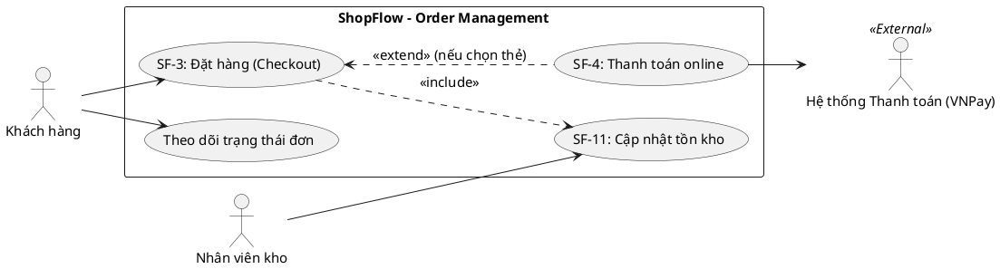

# Use Case Diagram và Use Case Specification

> Note này hướng dẫn cách vẽ Use Case Diagram đúng chuẩn UML và viết Use Case Specification (đặc tả text) chi tiết. Nó trả lời câu hỏi: "Ai (Actor) có thể làm gì (Goal) với hệ thống (System Boundary)?".

## Note này dùng để làm gì

Mở note khi bạn cần phân tích các hành vi cấp cao của hệ thống dựa trên yêu cầu người dùng, hoặc khi cần một tài liệu chi tiết cho đội dev/QA về cách một luồng nghiệp vụ phức tạp hoạt động. Đọc sau khi xác định **System Boundary** và trước khi viết **Sequence Diagram** hoặc **State Machine**.

## 1. Use Case Diagram (Biểu đồ) vs Use Case Specification (Đặc tả)

Nhiều BA nhầm lẫn Use Case chỉ là một cái biểu đồ hình oval. Thực tế, Use Case gồm 2 phần:
1. **Use Case Diagram:** Cung cấp cái nhìn tổng quan toàn hệ thống (chim bay).
2. **Use Case Specification:** Văn bản chi tiết hóa từng hình oval đó (đi vào mặt đất).

> **Lưu ý:** Biểu đồ Use Case sinh ra không phải để mô tả Thứ tự (Flow). Muốn mô tả thứ tự, hãy dùng **Activity Diagram**. Use Case chỉ quan tâm đến **Goal (Mục tiêu)**.

## 2. Các thành phần trong Use Case Diagram

### Giải thích Notation UML:
*   **Actor (Người/Hệ thống ngoài):** Hình người. Dùng role (Khách hàng), không dùng tên riêng.
*   **System Boundary (Ranh giới):** Hình chữ nhật bọc ngoài. Thể hiện ranh giới hệ thống ta đang xây dựng (ShopFlow).
*   **Use Case (Mục tiêu):** Hình oval (động từ + danh từ). Vd: Đặt hàng.
*   **Include:** Luôn luôn xảy ra. Vd: Đặt hàng thì bắt buộc phải (include) Cập nhật tồn kho.
*   **Extend:** Tùy chọn xảy ra. Vd: Đặt hàng có thể (extend) Thanh toán online (chỉ khi khách chọn thẻ, nếu COD thì không).

## 3. Cấu trúc Use Case Specification chuẩn

Một Use Case text chuẩn phải đủ các thành phần sau để không gây tranh cãi:

**Bảng Đặc tả Use Case (Use Case Specification):**

| Thuộc tính | Chi tiết |
|---|---|
| **Tên Use Case** | UC-ORD-001 Đặt hàng (Checkout) |
| **Tham chiếu** | Epic `SF-1`, Requirement `SF-3` |
| **Actor** | **Chính:** Khách hàng (Customer)   **Phụ:** VNPay |
| **Pre-conditions** | Khách đã có ≥1 sản phẩm trong giỏ. Khách đã đăng nhập/nhập email. |
| **Post-conditions**| Đơn hàng tạo thành công (Trạng thái "Pending"). Tồn kho `available` bị trừ. Đã gửi Email. |
| **Trigger** | Khách hàng bấm "Tiến hành Checkout" tại Giỏ hàng. |
| **Normal Flow** | 1. Hệ thống hiện form giao hàng & thanh toán. 2. Khách nhập địa chỉ, chọn COD. 3. Khách bấm "Xác nhận". 4. Hệ thống kiểm tra tồn kho (include UC_Inventory). Tồn kho đủ. 5. Hệ thống lưu đơn, trừ tồn kho, sinh Order ID. 6. Hệ thống hiển thị "Thành công". |
| **Alternate Flow** | **A1 (Chọn VNPay):** Tại bước 2, nếu chọn VNPay, hệ thống gọi (extend) UC_Payment. Thanh toán xong quay lại bước 5. **A2 (Sửa giỏ):** Tại bước 1, khách bấm "Quay lại giỏ hàng", chuyển về trang Cart. Hủy Use Case. |
| **Exception Flow** | **E1 (Hết hàng):** Tại bước 4, tồn kho `available` < số lượng đặt. Hệ thống chặn, báo lỗi "Sản phẩm X không đủ". **E2 (Lỗi DB):** Tại bước 5, database timeout, hệ thống báo lỗi "Thử lại sau" và không trừ kho. |

## 4. Anti-pattern (Những lỗi sai phổ biến)

*   **Biến Use Case thành Sơ đồ quy trình (Flowchart):** Dùng nét đứt mũi tên nối các Use Case với nhau (Bấm Login -> Xem danh sách -> Chọn hàng). Sai hoàn toàn UML. Muốn vẽ thứ tự, hãy dùng [[activity-diagram|Activity Diagram]].
*   **CRUD Use Case:** Vẽ 4 hình oval "Thêm User", "Sửa User", "Xóa User". Hãy gộp thành 1 Use Case "Quản lý User" (Manage User) để sơ đồ bớt rác.
*   **Thiếu Pre/Post condition:** Dẫn đến QA không biết setup data mẫu thế nào để test.

## 5. Checklist Review Use Case

- [ ] Sơ đồ đã bọc ranh giới hệ thống (System Boundary) chưa?
- [ ] Actor có phải là một vai trò, thay vì một cá nhân không?
- [ ] Tên Use Case có bắt đầu bằng động từ không?
- [ ] Đặc tả text đã liệt kê đủ luồng chính, luồng phụ, và ngoại lệ chưa?
- [ ] Tồn kho, database state có được định nghĩa rõ ràng ở Post-condition chưa?

## 6. References

- *OMG Unified Modeling Language (UML) Specification v2.5.1*, Section 18 (Use Cases).
- *BABOK Guide v3*, Section 10.47 (Use Cases and Scenarios).

## 7. Related

- Trích xuất luồng chi tiết: [[activity-diagram|Activity Diagram]]
- Xem tương tác kỹ thuật: [[sequence-diagram|Sequence Diagram]]
- Đóng gói vào tài liệu: [[srs-brd-for-ba|SRS và BRD]]
