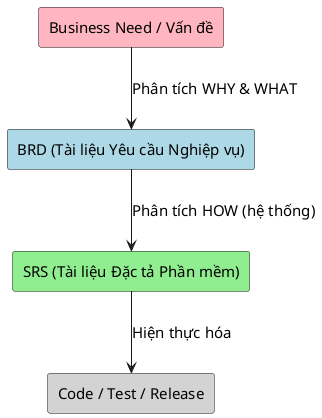

# SRS và BRD trong phân tích nghiệp vụ

> Note này làm rõ định nghĩa, sự khác biệt và cấu trúc của BRD (Business Requirements Document) và SRS (Software Requirements Specification). 

## Note này dùng để làm gì

Mở note khi bạn cần viết tài liệu tổng hợp bàn giao cho khách hàng (để ký nghiệm thu - BRD) hoặc bàn giao cho đội ngũ phát triển (để code - SRS). Bạn nên đọc phần này sau khi đã vững **Use Case** và **User Story**, vì SRS thường là nơi "chứa" các Use Case đó.

## 1. Phân biệt BRD và SRS

Nhiều người mới làm BA thường gom chung 2 tài liệu này hoặc nhầm lẫn chúng.

| Đặc điểm | BRD (Business Requirements Document) | SRS (Software Requirements Specification) |
|---|---|---|
| **Trả lời câu hỏi** | Hệ thống này giải quyết vấn đề kinh doanh gì? (WHY & WHAT) | Hệ thống phải hoạt động chính xác ra sao? (HOW) |
| **Đối tượng đọc** | Khách hàng, C-level, Business Owner | Dev, QA, System Architect |
| **Ngôn ngữ** | Kinh doanh, dễ hiểu, phi kỹ thuật | Kỹ thuật, logic chặt chẽ, chi tiết |
| **Ví dụ ShopFlow** | "Giảm tỷ lệ bán lố hàng tồn kho xuống 0" | "Khi ấn checkout, hệ thống check biến `available_stock` bằng transaction lock" |

## 2. Cấu trúc chuẩn của một SRS

SRS là tài liệu "xương sống" của các dự án truyền thống hoặc dự án outsource. Trong Agile, SRS có thể được thay thế bằng một bộ Backlog (gồm các Epic, User Story) + Wiki documentation. 

Dưới đây là khung cấu trúc SRS cơ bản (dựa theo chuẩn IEEE 830):

### 1. Introduction (Giới thiệu)
*   **Mục đích tài liệu:** Giải thích SRS này dành cho hệ thống nào (Vd: Hệ thống Quản lý Bán hàng ShopFlow).
*   **Phạm vi (Scope):** Hệ thống làm được gì và KHÔNG làm gì (In/Out of scope).
*   **Định nghĩa, Viết tắt (Glossary).**

### 2. Overall Description (Mô tả tổng quan)
*   **User Characteristics (Actor):** Phân quyền cơ bản (Khách hàng, Nhân viên, Chủ shop).
*   **System Environment:** Môi trường hoạt động (Web, Mobile App).
*   **Assumptions & Dependencies:** Giả định (Khách có mạng Internet) và Phụ thuộc (Tích hợp cổng VNPay).

### 3. System Features (Tính năng hệ thống)
Đây là phần cốt lõi và dài nhất của SRS. Chỗ này chính là nơi BA bê các **Use Case** hoặc **User Story** vào.
*   **3.1 Feature 1: Quản lý Đơn hàng (Epic SF-1)**
    *   3.1.1 Đặt hàng (Use Case: UC-ORD-001)
        *   Luồng chính, luồng phụ, luồng lỗi.
        *   Các quy tắc nghiệp vụ (Business Rules).
    *   3.1.2 Cập nhật trạng thái đơn.
*   **3.2 Feature 2: Quản lý Tồn kho...**

### 4. Non-Functional Requirements (Yêu cầu phi chức năng - NFR)
*   **Performance (Hiệu năng):** Thời gian load giỏ hàng < 2s.
*   **Security (Bảo mật):** Pass được mã hóa, session timeout 30 phút.
*   **Availability (Tính sẵn sàng):** Uptime 99.9%.

### 5. Appendices (Phụ lục)
*   Wireframe / Mockup UI.
*   Data Dictionary (Từ điển dữ liệu).

## 3. SRS trong kỷ nguyên Agile

Khác với Waterfall (viết xong SRS 100 trang mới code), trong Agile:
*   SRS không phải là tài liệu chốt cứng (Frozen).
*   Thường được lưu trên **Confluence / Wiki** thay vì file Word.
*   Được bẻ nhỏ thành các Epic và User Story (Sống trên Jira). Phần "System Features" (mục 3) biến thành Product Backlog.

## 4. Checklist Review SRS

- [ ] Có định nghĩa rõ ràng Out of Scope (Những thứ hệ thống không làm) chưa?
- [ ] Phần System Features đã bao phủ toàn bộ các Use Case / User Story chưa?
- [ ] Đã có yêu cầu Phi chức năng (NFR) chưa (thường hay bị quên)?
- [ ] Có kèm theo Wireframe hoặc Link tới thiết kế để minh họa không?
- [ ] Các Business Rules (quy tắc tính toán giảm giá, tính tồn kho) đã được mô tả không mâu thuẫn nhau chưa?
