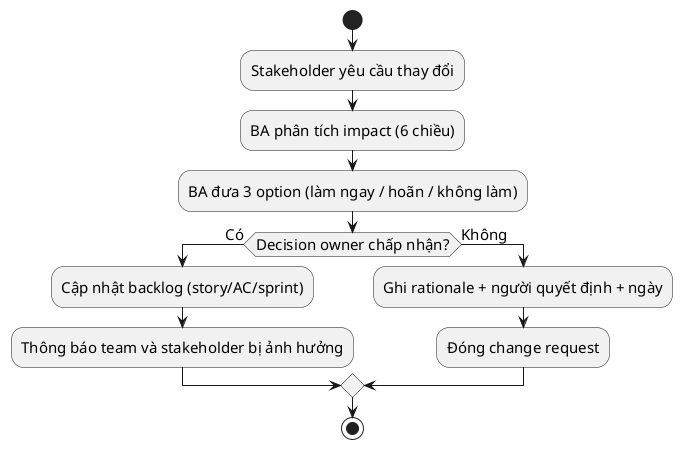

# Change Request và Impact Analysis cho BA

> Note này giúp BA xử lý khi stakeholder muốn đổi requirement hoặc scope sau khi
> đã bắt đầu build. Không phải mọi thay đổi đều là "scope creep" — một số là học
> từ feedback thật. Vai trò BA là phân tích impact, đưa option và để decision
> owner quyết định.

## Note này dùng để làm gì

Mở note khi stakeholder yêu cầu thay đổi requirement giữa sprint, PO muốn thêm
story mới, hoặc constraint mới xuất hiện làm thay đổi scope. Đọc sau
[[backlog-refinement|Backlog Refinement]].

## 1. Change request không phải kẻ thù

| Thay đổi tốt | Thay đổi xấu |
|---|---|
| Học từ sprint review: "khách hàng không dùng search, cần filter theo giá" | "Em nghĩ thêm cái nút Share lên Facebook sẽ hay" — không có evidence |
| Constraint mới có thật: "payment gateway yêu cầu KYC, không làm mock được nữa" | "Sếp muốn đổi màu nút" giữa sprint |
| Lộ rule lúc UAT: "phải có approval khi return > 500k" — đây là rule thật, không phải ý thích | Preference cá nhân không có impact |

Phân biệt bằng evidence: thay đổi có trace về objective/outcome/constraint không?

## 2. Impact analysis: sáu chiều

Trước khi trả lời "được" hay "không", BA phân tích impact:

| Chiều | Câu hỏi |
|---|---|
| **Scope** | thay đổi ảnh hưởng story nào? story nào phải đổi AC? story nào phải huỷ? |
| **Effort** | bao nhiêu điểm/giờ bị ảnh hưởng? story đã làm xong có phải sửa không? |
| **Schedule** | sprint hiện tại bị delay không? sprint sau phải đổi priority không? |
| **Dependency** | API, team khác, bên thứ ba có bị ảnh hưởng? |
| **Risk** | rủi ro mới? assumption cũ còn đúng không? |
| **Value/outcome** | thay đổi có tăng value không? nếu không, vì sao vẫn nên làm? |

## 3. Ba option BA luôn đưa ra

Với mỗi change request, BA đưa ít nhất ba option:

| Option | Khi nào chọn | Ví dụ |
|---|---|---|
| **Làm ngay** | impact nhỏ, value cao, không block sprint | sửa label "Đặt hàng" → "Mua ngay" — 10 phút |
| **Hoãn sang sprint sau** | value rõ nhưng impact lớn, không thể nhét vào sprint hiện tại | thêm filter giá — 3 điểm, Sprint 2 |
| **Không làm** | không trace về objective, preference cá nhân, hoặc vi phạm constraint | "thêm animation confetti khi order thành công" |

Luôn ghi rationale cho option được chọn.

## 4. Ghi change log

Mỗi thay đổi phải được ghi lại:

| Field | Ví dụ |
|---|---|
| **Change ID** | CR-004 |
| **Ngày** | 2026-07-18 |
| **Người yêu cầu** | Chủ shop |
| **Mô tả** | Thêm rule: đơn > 1 triệu phải có xác nhận qua điện thoại trước khi giao |
| **Impact** | `SF-3` Create Order: thêm AC "nếu total > 1,000,000 → order status = Pending Confirmation thay vì Pending Payment"; `SF-4` Payment: mock thêm trạng thái chờ |
| **Option đề xuất** | Hoãn sang Sprint 2 (impact 3 điểm, không block Sprint 1) |
| **Decision** | PO chấp nhận hoãn, thêm vào Sprint 2 backlog |
| **Cập nhật** | `SF-3` AC bổ sung; `SF-4` estimate tăng từ 3 → 5 |

### Running case: ShopFlow

Ba change request thực tế trong dự án ShopFlow:

**CR-001: Thêm rule "đơn > 1 triệu phải gọi xác nhận" — Nguồn: chủ shop, giữa Sprint 1.**

| Chiều impact | Phân tích |
|---|---|
| Scope | `SF-3` Create Order: thêm AC "If total > 1,000,000 then status = PENDING_CONFIRMATION"; `SF-4` Payment: thêm mock trạng thái chờ |
| Effort | 3 điểm (BE thêm validation + FE thêm màn hình confirm) |
| Schedule | Sprint 1 đang chạy (`SF-2`, `SF-3`, `SF-6`), không thể nhét thêm |
| Risk | thấp — rule rõ, dễ test |
| Option | **Hoãn sang Sprint 2.** Lý do: không block core flow Sprint 1 (khách vẫn browse + order được); value rõ (giảm rủi ro đơn ảo) nhưng không khẩn cấp. PO chấp nhận. |

**CR-002: Bỏ mock payment, tích hợp VNPay thật — Nguồn: chủ shop, Sprint 2 planning.**

| Chiều impact | Phân tích |
|---|---|
| Scope | `SF-4` Simulate Payment: phải viết lại toàn bộ; thêm dependency VNPay SDK |
| Effort | 8 điểm (từ 3 → 8, phải tích hợp thật + test sandbox) |
| Schedule | Đẩy `SF-5` Delivery + `SF-7` Receive sang Sprint 3 |
| Dependency | Cần tài khoản VNPay test, chưa có — lead time 1–2 tuần |
| Risk | Cao — VNPay sandbox có thể không hỗ trợ đủ test case; nếu chậm → block Sprint 2 |
| Option | **Không làm trong MVP.** Lý do: constraint Epic `SF-1` là "không payment thật"; thay đổi constraint này = thay đổi scope MVP; nếu muốn, tạo Epic mới sau MVP. PO chấp nhận giữ mock. |

**CR-003: Thêm nút "Hủy đơn" cho khách hàng — Nguồn: khách hàng sample, sau Sprint 1 review.**

| Chiều impact | Phân tích |
|---|---|
| Scope | `SF-3` Create Order: thêm transition "PENDING_PAYMENT → CANCELLED by customer"; `SF-6` stock: unreserve stock khi hủy |
| Effort | 2 điểm (thêm 1 API cancel + 1 nút ở FE) |
| Schedule | Có thể nhét vào Sprint 2 (còn dư capacity sau khi estimate `SF-4`, `SF-5`, `SF-7` = 9 điểm / capacity 13) |
| Risk | Thấp — cancel là hard delete với status PENDING_PAYMENT, không ảnh hưởng payment đã PAID |
| Option | **Làm ngay Sprint 2.** Lý do: value cao (khách hàng feedback trực tiếp), impact thấp, team còn capacity. PO chấp nhận. |

**Bài học:** Cùng là "thay đổi requirement", CR-001 (hoãn), CR-002 (từ chối), CR-003 (làm ngay) — BA không tự quyết. BA phân tích impact, đưa option, PO quyết định. Nếu BA nói "không" với mọi thay đổi, team mất cơ hội học từ feedback thật.

## Anti-patterns

| Anti-pattern | Vì sao nguy hiểm | Cách sửa |
|---|---|---|
| BA từ chối mọi thay đổi | mất feedback thật, sản phẩm không phù hợp | phân tích impact, để PO quyết định |
| BA nhận mọi thay đổi không phân tích | scope creep, team overload, sprint thất bại | luôn phân tích 6 chiều impact trước khi trả lời |
| Không ghi change log | không ai nhớ vì sao quyết định, lặp lại tranh luận | mỗi change có ID, impact, option, decision, ngày |
| Change request không có decision owner | BA bị đổ lỗi "sao không làm" | luôn có PO hoặc sponsor ký decision |
| Coi mọi thay đổi là "scope creep" | bỏ lỡ requirement thật chỉ vì lộ muộn | phân biệt learning vs preference bằng evidence |

## Checklist nhanh

- Thay đổi có trace về objective/outcome/constraint không? Hay chỉ là preference?
- Đã phân tích impact trên 6 chiều (scope, effort, schedule, dependency, risk, value)?
- Đã đưa ít nhất 3 option (làm ngay / hoãn / không làm)?
- Decision owner đã chốt chưa? Rationale đã ghi?
- Backlog đã được cập nhật (AC, estimate, sprint)?
- Team và stakeholder bị ảnh hưởng đã được thông báo?

## References

- [IIBA — BABOK Guide](https://www.iiba.org/career-resources/a-business-analysis-professionals-foundation-for-success/babok/) — Requirements Life Cycle Management, change management và traceability.
- [Atlassian — Managing Scope Changes](https://www.atlassian.com/agile/project-management/scope-creep) — cách xử lý thay đổi scope trong Agile.

## Related

- [[backlog-refinement|Backlog Refinement cho BA]]
- [[scope-assumptions-constraints|Scope, Assumptions & Constraints]]
- [[requirement-quality-and-validation|Requirement Quality & Validation]]
