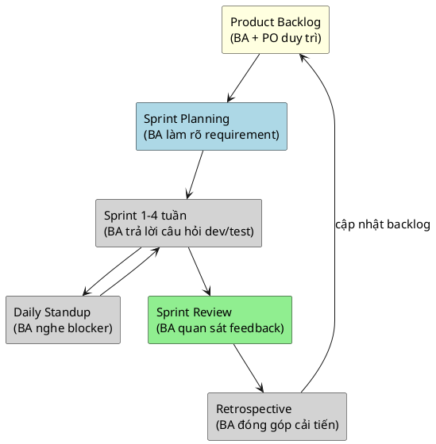

> Note này giúp BA nắm các khái niệm Agile/Scrum nền tảng cần biết để làm việc
> trong sprint: work item types, roles, ceremonies, DoR/DoD và estimation. Không
> dạy Scrum Guide thuộc lòng mà tập trung vào những gì BA thực sự dùng hằng ngày.

## Note này dùng để làm gì

Mở note khi bạn mới vào một team Agile, cần biết vocabulary và cách các ceremony
liên kết với công việc BA. Đọc trước khi vào
[từ case study ra backlog](/posts/agile-delivery/case-study-to-agile-ba-delivery) hay
[viết story và AC](/posts/agile-delivery/user-story-and-acceptance-criteria).

## 1. Mental model: Agile là vòng lặp giảm uncertainty, Scrum là khung vận hành

Agile là tư duy (manifesto), Scrum là một khung cụ thể. BA không cần chọn —
cần hiểu Scrum vì phần lớn team dùng nó.

BA có mặt ở mọi ceremony nhưng **không dẫn** tất cả. BA dẫn phần requirement
trong planning và refinement; PO dẫn review; Scrum Master dẫn retro.

## 2. Work item types: từ lớn tới nhỏ

| Item | Định nghĩa | Ai sở hữu | BA làm gì |
|---|---|---|---|
| **Epic** | goal lớn, cần nhiều sprint để hoàn thành | PO + BA | BA phân rã epic thành story dựa trên discovery |
| **User Story** | một lát giá trị cho một actor, làm xong trong 1 sprint | BA viết, PO ưu tiên | BA viết story + AC, đảm bảo trace về need |
| **Task / Sub-task** | việc kỹ thuật cụ thể (dev, test, deploy) | Developer / Tester | BA review để đảm bảo không sót AC |
| **Bug** | lỗi so với expected behavior | Tester report, dev fix | BA xác nhận expected behavior và impact |
| **Spike** | research để giảm uncertainty | Dev hoặc BA | BA làm spike phân tích (ví dụ: "có cần tích hợp payment thật không?") |

## 3. Ba roles Scrum BA cần hiểu

| Role | Trách nhiệm | BA tương tác thế nào |
|---|---|---|
| **Product Owner (PO)** | sở hữu backlog, ưu tiên, quyết định scope/value | BA cung cấp evidence, option và trade-off để PO quyết định |
| **Scrum Master (SM)** | bảo vệ process, gỡ blocker, facilitation | BA phối hợp với SM khi workshop có power dynamic phức tạp |
| **Development Team** | build, test, deliver increment | BA viết story + AC đủ rõ để dev/test làm việc; BA trả lời câu hỏi trong sprint |

PO và BA khác nhau: **BA phân tích và đưa option; PO quyết định priority.**
Nếu một người làm cả hai, phải tách rõ hai mũ khi giao tiếp.

## 4. Bốn ceremony BA phải tham gia

| Ceremony | Mục đích | BA làm gì | Tần suất |
|---|---|---|---|
| **Sprint Planning** | chọn item từ backlog cho sprint tới | BA trình bày requirement, làm rõ AC, trả lời câu hỏi | đầu mỗi sprint |
| **Daily Standup** | đồng bộ tiến độ, nêu blocker | BA nghe, ghi nhận blocker liên quan requirement, không report status | mỗi ngày |
| **Sprint Review** | demo increment, lấy feedback | BA quan sát phản ứng của stakeholder với sản phẩm thật, ghi gap | cuối sprint |
| **Retrospective** | cải tiến process | BA nêu observation về requirement flow: AC có đủ rõ? Refinement có đủ sâu? | cuối sprint |

**Không có trong Scrum Guide nhưng BA dẫn chính:** Backlog Refinement (xem
[note riêng](/posts/agile-delivery/backlog-refinement)).

## 5. DoR và DoD

| Khái niệm | Định nghĩa | Câu hỏi kiểm |
|---|---|---|
| **Definition of Ready (DoR)** | item đủ rõ để team bắt đầu làm | Story có AC không? Dependency đã resolved chưa? UI/UX đã có wireframe? |
| **Definition of Done (DoD)** | item đạt chất lượng để release | Code đã review? Test đã pass? AC đã được verify? Tài liệu đã cập nhật? |

BA chịu trách nhiệm phần DoR liên quan tới requirement (AC, dependency, UX
ready). BA hỗ trợ verify AC trong DoD nhưng không ký duyệt một mình.

## 6. Estimation và velocity

| Khái niệm | Định nghĩa | BA cần biết |
|---|---|---|
| **Story Point** | effort tương đối (không phải giờ), dùng Fibonacci (1, 2, 3, 5, 8, 13) | BA tham gia estimation bằng cách làm rõ scope, không tự gán điểm |
| **Velocity** | tổng story point team hoàn thành trong sprint trước | BA dùng velocity để ước tính khi nào backlog item được làm |
| **Capacity** | số giờ thực tế team có trong sprint (trừ nghỉ, họp, overhead) | BA không cần tính nhưng cần hiểu để không ép quá nhiều story vào sprint |

### Running case: ShopFlow

Dự án ShopFlow vận hành theo Scrum trên Jira (`tuanwork.atlassian.net`):

**Work item hierarchy:**
- **Epic `SF-1`** "Online Shop Sales and Inventory MVP" — PO (chủ shop) định nghĩa goal: "vận hành luồng bán hàng cơ bản, kiểm soát tồn kho, giảm bán quá stock". BA phân rã thành 8 User Story `SF-2..SF-9`.
- **Story** — ví dụ `SF-3` Create Customer Order: `Là Khách hàng, tôi muốn tạo đơn hàng từ catalog, để mua hàng không cần gọi điện`. Mỗi story có 2-3 AC. BA viết story + AC, PO ưu tiên High/Medium.
- **Sub-task** — ví dụ `SF-11` Stock Validation, `SF-12` Order Data Model, `SF-13` Verify Order Scenarios (QA). Dev tự tách, BA review.

**Ceremonies ShopFlow:**
- Sprint Planning: BA trình bày `SF-3`, làm rõ "kiểm tra stock lúc submit chứ không phải lúc add to cart" → team hiểu, AC được chốt.
- Daily: dev nêu blocker "chưa rõ return window `SF-8`" → BA ghi nhận, follow-up với chủ shop, cập nhật AC trước standup hôm sau.
- Review: chủ shop demo thử browse catalog `SF-2` → phát hiện "ảnh sản phẩm quá nhỏ trên mobile" → BA ghi thành AC bổ sung cho `SF-38` wireframe.
- Retro: BA đề xuất "AC nên có thêm concrete example ở mỗi story — sprint này `SF-13` viết quá abstract, dev phải hỏi lại 2 lần."

**Estimation thực tế:** `SF-3` Create Order ước tính 5 điểm (Fibonacci), `SF-5` Delivery Status 3 điểm, `SF-7` Receive Stock 3 điểm. `SF-3` > 3 điểm vì liên quan atomic stock check `SF-11` phức tạp.

**Bài học:** BA không chỉ viết story rồi "ném qua tường" cho dev. BA phải có mặt trong sprint để làm rõ requirement khi dev gặp ambiguity — nếu không, dev tự đoán và requirement thành ra sai.

## Anti-patterns

| Anti-pattern | Vì sao nguy hiểm | Cách sửa |
|---|---|---|
| BA chỉ viết story, không tham gia sprint | ambiguity không được resolve, dev tự đoán | tham gia standup, trả lời câu hỏi trong sprint |
| "Mọi thứ đều Must" | không phân biệt được thứ gì thực sự quyết định success | dùng MoSCoW, gắn outcome |
| Story không có AC | team không biết "done" là gì | mỗi story phải có 2-3 AC verifiable trước refinement |
| BA kiêm PO nhưng không tách role | ưu tiên bị bias bởi solution yêu thích | tách rõ: "với mũ BA tôi thấy 3 option; với mũ PO tôi chọn option 2 vì..." |
| Sprint "chỉ là deadline 2 tuần" | mất vòng feedback, thành mini-waterfall | giữ review + demo; lấy feedback stakeholder thật |
| Estimation thành cam kết | team bị ép deadline, bỏ AC để kịp | story point là ước lượng, không phải hợp đồng |

## Checklist nhanh

- Team dùng Scrum, Kanban hay hybrid? BA cần điều chỉnh gì?
- Tôi biết phân biệt Epic, Story, Task, Bug, Spike chưa?
- Tôi có mặt ở planning, standup, review không? Tôi đóng góp gì ở mỗi ceremony?
- Story tôi viết có AC trước khi vào sprint không?
- Tôi có đang tự ưu tiên backlog thay vì để PO quyết định không?

## References

- [Scrum Guide](https://scrumguides.org/) — định nghĩa chuẩn về Scrum roles, events, artifacts.
- [Atlassian Agile Coach](https://www.atlassian.com/agile) — hướng dẫn thực hành Agile/Scrum cho team.

## Related

- [Agile vs Waterfall cho BA](/posts/foundations/agile-vs-waterfall-for-ba)
- [User Story & AC cho BA](/posts/agile-delivery/user-story-and-acceptance-criteria)
- [Backlog Refinement cho BA](/posts/agile-delivery/backlog-refinement)
- [Từ case study ra backlog Agile](/posts/agile-delivery/case-study-to-agile-ba-delivery)

