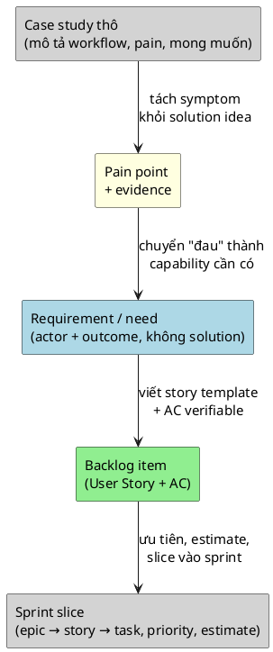

> Note này giúp BA đi từ case study thô (mô tả nghiệp vụ, workflow hiện tại, pain
> point) tới một product backlog có story, AC, sprint slice, priority và story
> point. Đây là cầu nối giữa discovery (nhóm 01) và delivery (nhóm 04).

## Note này dùng để làm gì

Mở note khi bạn có case study hoặc requirement đã làm rõ và cần biến chúng
thành backlog item để team bắt đầu sprint. Đọc sau
[Requirement Elicitation](/posts/discovery-and-requirements/requirement-elicitation) và
[Agile Concepts](/posts/agile-delivery/agile-concepts-for-ba).

## 1. Từ case thô tới pain point

Case study thường là văn bản mô tả workflow hiện tại + vấn đề + mong muốn.
Bước đầu là tách pain point — không phải mọi câu trong case đều là requirement.

## 2. Pipeline 5 bước

| Bước | Input | Output | Công cụ |
|---|---|---|---|
| 1. Đọc và tách | case study raw text | list pain point + actor + context | highlight, note |
| 2. Phân loại | pain point | fact, requirement, business rule, assumption, open question | taxonomy (xem [Requirement Elicitation §2](/posts/discovery-and-requirements/requirement-elicitation)) |
| 3. Viết story | requirement + actor + outcome | User Story (template `Là <role>...`) + 2–3 AC | template chuẩn |
| 4. Ưu tiên | story list | priority (High/Medium/Low) + rationale | MoSCoW, value/effort |
| 5. Slice sprint | prioritized story | sprint backlog + estimate | Fibonacci, capacity, dependency map |

## 3. Sprint slice: chọn gì cho sprint đầu

Nguyên tắc cho Sprint 1:
- Chọn story **tạo ra một flow end-to-end mỏng nhất** (walking skeleton).
- Không chọn story phụ thuộc nhau quá nhiều.
- Không nhồi quá team capacity (dùng velocity sprint trước nếu có).

| Yếu tố | Sprint 1 | Sprint 2 | Sprint 3 |
|---|---|---|---|
| **Mục tiêu** | core flow end-to-end | mở rộng + edge case | polish + integration |
| **Loại story** | happy path chính | exception, role phụ | report, alert, audit |
| **Ví dụ** | browse + order + basic stock | return + delivery status + payment mock | low stock alert + admin dashboard |

## 4. Estimate với team

BA không tự estimate. BA cung cấp context cho team estimate:

- **Trước estimate:** BA trình bày story + AC + wireframe (nếu có).
- **Trong estimate:** BA trả lời câu hỏi về rule, không về implementation.
- **Sau estimate:** BA ghi nhận story point và assumption.

Nếu team estimate > 8 điểm cho một story → BA split story ngay trong buổi
(xem [User Story & AC §5](/posts/agile-delivery/user-story-and-acceptance-criteria)).

### Running case: ShopFlow

Pipeline từ case study ShopFlow ra backlog:

**Bước 1–2: Từ case thô tới pain point cho từng actor:**

| Actor | Pain point (từ case) | Requirement |
|---|---|---|
| Khách hàng | "muốn mua hàng mà không biết shop còn gì, phải gọi điện" | browse catalog online |
| Khách hàng | "order xong không biết tới đâu, gọi 2–3 lần mới biết" | xem trạng thái đơn hàng |
| Chủ shop | "3 lần/tháng bán vượt stock, phải gọi xin lỗi khách" | hệ thống kiểm tra stock khi nhận order |
| Nhân viên kho | "sổ với thực tế lệch, không biết hàng nào còn" | một nguồn số liệu stock duy nhất |

**Bước 3: Viết story.** 8 User Story `SF-2..SF-9` (xem [User Story & AC](/posts/agile-delivery/user-story-and-acceptance-criteria)).

**Bước 4–5: Ưu tiên và sprint slice cho ShopFlow:**

| Sprint | Mục tiêu | Story | Điểm | Priority |
|---|---|---|---|---|
| **Sprint 1** | core flow: browse → order → basic stock | `SF-2` Browse Catalog, `SF-3` Create Order, `SF-6` Manage Stock | 3 + 5 + 5 = 13 | High |
| **Sprint 2** | mở rộng: payment + delivery + receiving | `SF-4` Simulate Payment, `SF-5` Delivery Status, `SF-7` Receive Stock | 3 + 3 + 3 = 9 | Medium–High |
| **Sprint 3** | xử lý ngoại lệ + alert | `SF-8` Process Return, `SF-9` Low Stock Alert | 5 + 2 = 7 | Medium |

**Lý do chọn Sprint 1:** `SF-2` + `SF-3` + `SF-6` tạo walking skeleton: khách
browse → order → stock check. Flow này end-to-end, chứng minh được giá trị
ngay sau review Sprint 1. Nếu chọn `SF-9` Low Stock Alert cho Sprint 1 — có
alert nhưng chưa có order flow, chẳng ai alert.

**Estimate thực tế:** Sprint 1 = 13 điểm. Team 3 người (1 BE + 1 FE + 1 BA
làm test), velocity ước tính 13–15 điểm/sprint → vừa capacity.

**Bài học:** Đừng bắt đầu sprint 1 với story "quản lý danh mục" (admin CRUD)
— đó là work not visible. Bắt đầu bằng flow mà stakeholder thấy được giá trị
ngay: khách browse catalog + tạo order. Walking skeleton trước, admin sau.

## Anti-patterns

| Anti-pattern | Vì sao nguy hiểm | Cách sửa |
|---|---|---|
| Chép nguyên case study thành story | lẫn pain point, solution idea và wish | pipeline 5 bước, phân loại taxonomy |
| Sprint 1 toàn story phụ thuộc | một story blocked → cả sprint blocked | chọn story độc lập cho sprint đầu |
| Tự estimate không có team | estimate không thực tế, team không commit | BA cung cấp context, team estimate |
| Sprint 1 chọn story "đẹp" thay vì end-to-end | sau Sprint 1 không demo được gì | luôn có ít nhất 1 flow end-to-end |
| Bỏ priority, mọi thứ High | team không biết làm gì trước | priority dựa trên value/risk, không phải opinion |

## Checklist nhanh

- Đã tách pain point khỏi solution idea trong case study chưa?
- Mỗi requirement đã trace về actor + outcome chưa?
- Sprint 1 có flow end-to-end không? Demo được gì?
- Tổng story point có khớp capacity không?
- Dependency giữa các story đã được map chưa?
- Priority có dựa trên value/risk, không phải opinion?

## References

- [Scrum Guide](https://scrumguides.org/) — Product Backlog management và sprint planning.
- [Atlassian — Sprint Planning](https://www.atlassian.com/agile/scrum/sprint-planning) — cách chọn item cho sprint và estimate.

## Related

- [Requirement Elicitation](/posts/discovery-and-requirements/requirement-elicitation)
- [Agile Concepts cho BA](/posts/agile-delivery/agile-concepts-for-ba)
- [User Story & AC cho BA](/posts/agile-delivery/user-story-and-acceptance-criteria)
- [Backlog Refinement cho BA](/posts/agile-delivery/backlog-refinement)

