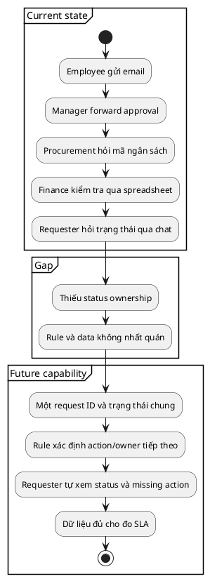

> Note này giúp BA mô tả cách công việc đang vận hành, trạng thái mong muốn và
> gap cần xử lý mà chưa nhảy thẳng vào thiết kế hệ thống.

## Note này dùng để làm gì

Mở note khi cần thống nhất “đang xảy ra gì”, tìm gap hoặc chuẩn bị đánh giá
solution option. Nếu problem chưa rõ, đọc [Problem Framing và Business Objectives cho BA](/posts/discovery-and-requirements/problem-framing-and-business-objectives).

## 1. Sáu lens của current state

| Lens | Câu hỏi |
|---|---|
| People | ai làm, quyết định, chịu impact? |
| Process | trigger, step, handoff, exception, end state? |
| Information | dữ liệu/artifact nào được tạo, dùng, mất? |
| Technology | hệ thống/tool nào hỗ trợ hoặc cản trở? |
| Policy/rule | rule nào có authority, rule nào chỉ là thói quen? |
| Performance | volume, wait time, error/rework và baseline? |

Evidence nên kết hợp observation, artifact/log và interview. Quy trình được kể
không mặc định là quy trình thật.

## 2. Future state mô tả capability và outcome

Future state không đồng nghĩa “xây portal”. Capability “một nguồn trạng thái có
owner” có thể được đáp ứng bằng thay đổi process, cấu hình tool hiện có hoặc xây
mới. Giữ solution space mở tới option analysis.

## 3. Gap classification

| Gap | Ví dụ | Handoff thường gặp |
|---|---|---|
| Capability | requester không tự theo dõi | solution option/use case |
| Process | handoff không owner/SLA | process modeling |
| Data | thiếu budget code chuẩn | data model/dictionary |
| Skill/role | approver không biết rule | training/RACI |
| Policy | exception chưa có authority | policy decision |
| Technology | tool không lưu transition | integration/solution analysis |

Gap phải trace về evidence và objective. “Chưa có mobile app” không phải gap nếu
không chứng minh capability/outcome bị thiếu.

## 4. Running case: ShopFlow

Áp sáu lens (§1) để phân tích current state của shop trước khi có ShopFlow:

| Lens | Current state (manual) | Evidence source |
|---|---|---|
| People | chủ shop một mình nhận order + kiểm kho + giao hàng; khách gọi điện/chat đặt hàng | interview chủ shop (`SF-3` elicitation) |
| Process | khách nhắn order → chủ shop chạy ra kho đếm → báo còn/hết → nếu còn thì ghi sổ → giao; nếu hết thì gọi xin lỗi | observation 1 buổi sáng tại shop |
| Information | order ghi sổ tay, stock đếm thủ công, không có lịch sử order/stock movement | artifact: sổ ghi chép của chủ shop |
| Technology | điện thoại + sổ giấy; không có database, không có web | — |
| Policy/rule | "nếu thiếu 1 món thì hủy cả đơn" là rule ngầm, chưa viết ra; không có policy return | interview chủ shop |
| Performance | ~3 lần/tháng order vượt stock; mỗi lần mất ~15 phút gọi điện; 1 khách cancel/lần | log cuộc gọi của chủ shop |

**Gap → Future capability → Transition:**

| Gap (phân loại) | Evidence | Future capability | Transition need |
|---|---|---|---|
| Capability: không kiểm tra stock khi nhận order | 3 lần/tháng bán vượt stock | hệ thống check stock real-time, reject nếu thiếu (`SF-11`) | map danh sách sản phẩm hiện có vào DB `SF-10` |
| Process: không có trạng thái đơn hàng | khách phải gọi hỏi "đơn tới đâu rồi" | khách xem được trạng thái order (Pending Payment → Delivered) qua `SF-3` + `SF-5` | train khách quen dùng web thay vì gọi |
| Data: không lưu lịch sử stock movement | không biết hàng nào nhập khi nào, còn bao nhiêu | `SF-6` inventory management + `SF-7` receive supplier stock có audit trail | nhập stock đầu kỳ từ sổ giấy vào hệ thống |
| Technology: không có hệ thống | toàn bộ vận hành bằng tay | Spring Boot backend + Vue 3 frontend (MVP) | deploy môi trường test, training 2 nhân viên kho |

**Constraint:** MVP không tích hợp payment gateway thật (`SF-4` dùng mock), không tích hợp đơn vị vận chuyển (`SF-5` cập nhật thủ công). Authentication đơn giản, chưa có RBAC.

**Open question:** dữ liệu sổ ghi chép cũ có cần migrate vào hệ thống không? Owner: chủ shop, hạn trước Sprint 0.

## 5. Anti-patterns

| Anti-pattern | Cách sửa |
|---|---|
| current state chỉ có happy path | lấy exception/rework và observed workaround |
| future state là list màn hình | viết capability/outcome trước |
| vẽ process không có baseline | gắn volume/time/error source |
| mọi difference đều thành gap | trace về objective và impact |
| bỏ transition | ghi migration, training, rollout need |

## 6. Checklist nhanh

- Current state có evidence trên sáu lens không?
- Flow được kể và flow quan sát có khác nhau không?
- Future state mô tả capability thay vì feature không?
- Mỗi gap có evidence, impact và owner không?
- Constraint/assumption/transition need đã tách chưa?
- Output đã đủ cho option analysis chưa?

## References

- [IIBA — BABOK Guide](https://www.iiba.org/career-resources/a-business-analysis-professionals-foundation-for-success/babok/) — current state, future state, gap/risk trong Strategy Analysis.

## Related

- [Problem Framing & Business Objectives](/posts/discovery-and-requirements/problem-framing-and-business-objectives)
- [Stakeholder Analysis & Engagement](/posts/discovery-and-requirements/stakeholder-analysis-and-engagement)
- [Scope, Assumptions & Constraints](/posts/discovery-and-requirements/scope-assumptions-constraints)
- [Solution Options & Business Case](/posts/discovery-and-requirements/solution-options-and-business-case)

