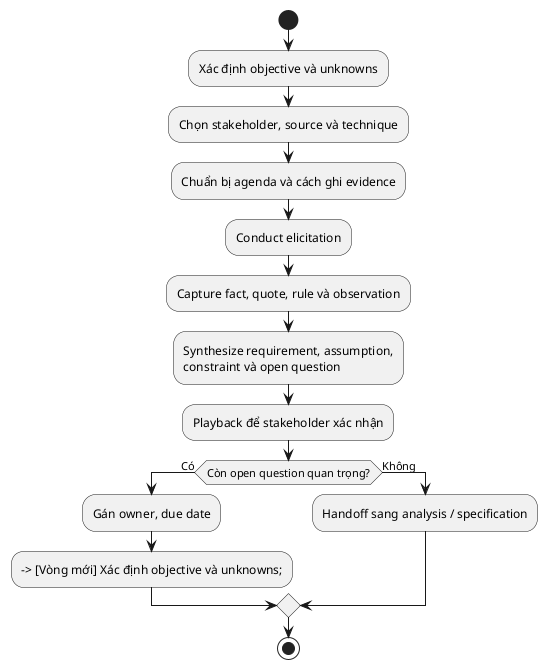

> Note này giúp BA lập và thực hiện một vòng elicitation có mục tiêu, tạo ra
> evidence và requirement có thể xác nhận. Elicitation không phải hỏi stakeholder
> muốn màn hình gì; nó là quá trình khám phá nhu cầu, rule, constraint và điều
> chưa biết trước khi khóa solution.

## Note này dùng để làm gì

Mở note khi cần bắt đầu discovery, chuẩn bị buổi làm việc với stakeholder hoặc
biến một yêu cầu mơ hồ thành đầu ra có cấu trúc.

Đọc kèm [Problem Framing](/posts/discovery-and-requirements/problem-framing-and-business-objectives),
[Stakeholder Analysis](/posts/discovery-and-requirements/stakeholder-analysis-and-engagement) và
[Elicitation Technique Selection](/posts/discovery-and-requirements/elicitation-technique-selection).

## 1. Mental model: elicitation là vòng lặp giảm uncertainty

Một buổi họp không đồng nghĩa đã elicitation xong. BA phải biết câu hỏi cần trả
lời, chọn nguồn evidence, ghi nhận đúng loại thông tin, tổng hợp rồi quay lại xác
nhận. Open question quan trọng sẽ mở một vòng mới.

Sơ đồ là vòng kiểm soát uncertainty, không phải quy trình phê duyệt cứng. Một
project nhỏ có thể đi hết vòng trong vài giờ; discovery phức tạp có thể lặp nhiều
tuần.

## 2. Phân loại output ngay khi ghi nhận

| Loại | Câu hỏi nhận diện | Ví dụ trong case mua thiết bị |
|---|---|---|
| Fact / evidence | điều gì đã quan sát hoặc có nguồn? | 18/50 yêu cầu tháng trước phải hỏi lại trạng thái qua chat |
| Pain point | fact gây hậu quả gì cho ai? | nhân viên và Procurement mất thời gian dò email |
| Requirement / need | capability hoặc outcome nào cần có? | người gửi cần biết trạng thái và người đang xử lý |
| Business rule | quyết định bị chi phối bởi luật nào? | yêu cầu trên 20 triệu cần Finance duyệt |
| Solution idea | ai đang đề xuất cách làm gì? | “làm dashboard có ba cột” |
| Assumption | điều đang tin nhưng chưa có evidence? | Manager luôn duyệt trước Finance |
| Constraint | giới hạn không được tùy ý thay đổi? | phải dùng tài khoản công ty để truy cập |
| Open question | điều gì cần ai xác nhận? | ai xử lý khi Manager nghỉ phép? |

**Requirement không phải solution idea.** “Cần biết trạng thái” là nhu cầu;
“dashboard ba cột” chỉ là một phương án. Giữ cả hai nhưng không đổi nhãn.

## 3. Elicitation plan tối thiểu

Trước mỗi activity, ghi được:

1. **Decision/unknown:** sau activity phải biết hoặc quyết định được gì?
2. **Source:** ai/tài liệu/hành vi nào có evidence gần vấn đề nhất?
3. **Technique:** interview, workshop, observation, document analysis, survey hay
   prototype; lý do chọn và điểm yếu.
4. **Logistics:** participant, thời lượng, agenda, pre-read, consent/recording.
5. **Capture:** ai ghi, lưu ở đâu, cách phân biệt quote với interpretation.
6. **Confirmation:** playback trong buổi, summary sau buổi hay walkthrough riêng.

Không có objective thì agenda chỉ là danh sách chủ đề. Không có confirmation thì
meeting note vẫn là diễn giải của BA, chưa phải shared understanding.

## 4. Chọn technique ở mức tổng quan

| Cần khám phá | Technique thường hữu ích | Điểm yếu phải bù |
|---|---|---|
| trải nghiệm cá nhân, chủ đề nhạy cảm | interview | phụ thuộc hồi tưởng và cách hỏi |
| tạo đồng thuận, xử lý nhiều góc nhìn | workshop | groupthink, người có quyền lấn át |
| cách làm thật khác quy trình được kể | observation | người bị quan sát có thể đổi hành vi |
| rule/quy trình/hệ thống hiện hữu | document analysis | tài liệu có thể lỗi thời |
| tín hiệu trên số lượng người lớn | survey | khó đào sâu; câu hỏi sai tạo dữ liệu đẹp nhưng vô ích |
| feedback sớm về flow/interaction | prototype | dễ khóa solution quá sớm |

Xem decision matrix đầy đủ ở [Chọn kỹ thuật Elicitation cho BA](/posts/discovery-and-requirements/elicitation-technique-selection).

## 5. Ví dụ: từ câu nói tới requirement

Stakeholder nói: “Làm cho tôi dashboard để không phải trả lời nhân viên suốt.”

BA không chép nguyên câu thành requirement. Sau probing và kiểm tra mẫu email:

- **Fact:** Procurement nhận trung bình 12 câu hỏi trạng thái/ngày trong tuần cao điểm.
- **Pain point:** người xử lý bị ngắt việc; người gửi không biết yêu cầu đang ở đâu.
- **Requirement:** người gửi được xem trạng thái hiện tại, người đang xử lý và
  action còn thiếu của yêu cầu do mình tạo.
- **Solution idea:** dashboard ba cột theo đề xuất ban đầu.
- **Assumption:** hiển thị người xử lý không vi phạm policy nội bộ.
- **Open question:** Security xác nhận nhóm nào được xem tên người phê duyệt,
  owner là Security Lead, hạn thứ Sáu.

## 6. Anti-patterns

| Anti-pattern | Vì sao nguy hiểm | Cách sửa |
|---|---|---|
| hỏi “anh/chị muốn hệ thống làm gì?” rồi dừng | thu solution preference, không hiểu problem | hỏi lần gần nhất, evidence, consequence và outcome |
| một technique cho mọi tình huống | bias của technique trở thành gap | chọn theo unknown và triangulate nguồn |
| ghi interpretation như quote | mất ranh giới fact/assumption | dùng nhãn và giữ source |
| chỉ lưu meeting minutes | không tạo requirement/open-question register | synthesize sau buổi theo output taxonomy |
| gửi biên bản nhưng không yêu cầu phản hồi | im lặng bị hiểu thành xác nhận | nêu rõ phần cần confirm, owner và deadline |

## 7. Checklist nhanh

- Objective và unknown của activity đã rõ chưa?
- Đã chọn đúng stakeholder/source gần evidence nhất chưa?
- Technique có phù hợp, và điểm yếu được bù bằng cách nào?
- Fact, requirement, solution idea và assumption có tách nhãn không?
- Mỗi open question có owner và due date không?
- Stakeholder đã playback/confirm phần liên quan chưa?
- Output đã đủ để analysis tiếp mà không tự đoán chưa?

### Running case: ShopFlow

Toàn bộ discovery của ShopFlow (Epic `SF-1`) đi đúng vòng elicitation ở §1:

| Bước vòng lặp | ShopFlow thực tế |
|---|---|
| Objective & unknowns | làm rõ 8 luồng nghiệp vụ bán hàng + kiểm soát tồn kho cho shop nhỏ; unknown lớn nhất: "liệu có cần tích hợp payment/shipper thật không?" |
| Stakeholder, source, technique | 3 nhóm stakeholder (chủ shop, nhân viên kho, khách hàng); chọn interview 1-1 cho chủ shop + observation cách nhân viên kho kiểm hàng thủ công |
| Conduct + capture | ghi nhận fact, pain point, rule — không chép solution idea thành requirement |
| Synthesize | output là 8 User Story `SF-2..SF-9`, domain model `SF-10`, constraint "không payment/shipper thật" |
| Playback | mỗi story được chủ shop xác nhận AC trước khi vào sprint |

**Áp taxonomy §2 cho một buổi elicitation `SF-3 Create Customer Order`:**

| Loại | Ghi nhận từ chủ shop |
|---|---|
| Fact | "tháng trước 3 lần khách order 5 mà kho còn 2, phải gọi xin lỗi" |
| Pain point | bán vượt stock gây mất uy tín, tốn thời gian gọi điện |
| Requirement | hệ thống phải kiểm tra stock thực tế trước khi nhận order |
| Business rule | nếu một item trong order thiếu stock, reject toàn bộ order (atomic — `SF-11`) |
| Solution idea | "cho cái nút kiểm tra hàng trước khi bấm đặt" |
| Assumption | stock trong database luôn đồng bộ với stock thực tế |
| Constraint | MVP không tích hợp real-time inventory sync |
| Open question | ai được phép override stock validation? — gán cho chủ shop, hạn trước Sprint 2 |

Bài học: nếu BA chép nguyên "cho cái nút kiểm tra hàng" thành requirement thì dev sẽ build một nút nhưng bỏ qua rule atomic reject `SF-11` — bug lộ ra khi khách order 3 mặt hàng, 1 mặt thiếu stock.

## References

- [IIBA — BABOK Guide](https://www.iiba.org/career-resources/a-business-analysis-professionals-foundation-for-success/babok/) — khung tham chiếu cho Elicitation and Collaboration và các knowledge area liên quan.
- [UK Government Service Manual — User research](https://www.gov.uk/service-manual/user-research) — hướng dẫn thực hành nghiên cứu nhu cầu, chọn participant và dùng evidence trong service discovery.

## Related

- [Problem Framing & Business Objectives](/posts/discovery-and-requirements/problem-framing-and-business-objectives)
- [Stakeholder Analysis & Engagement](/posts/discovery-and-requirements/stakeholder-analysis-and-engagement)
- [Elicitation Technique Selection](/posts/discovery-and-requirements/elicitation-technique-selection)
- [Requirement Quality & Validation](/posts/discovery-and-requirements/requirement-quality-and-validation)

