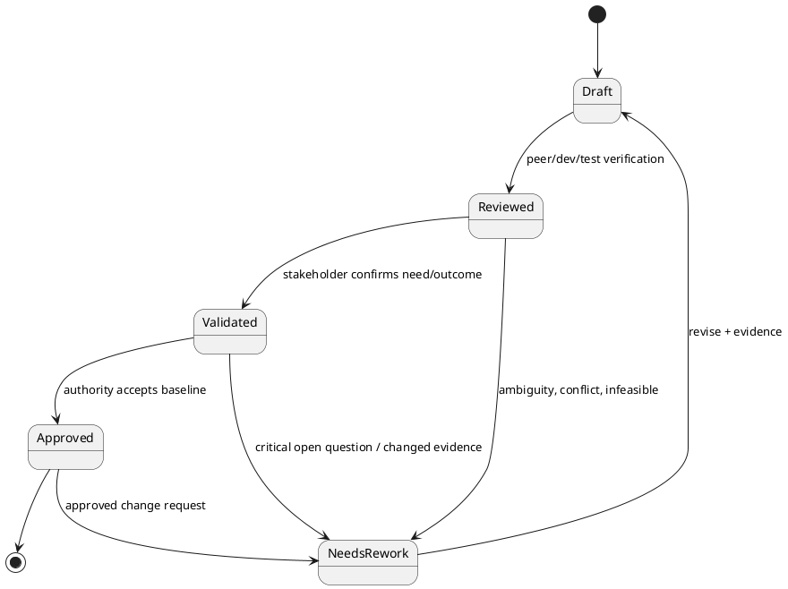

> Note này giúp BA kiểm tra requirement được viết đủ tốt và đúng nhu cầu trước
> handoff. Verification hỏi “mô tả có chất lượng không”; validation hỏi “đây có
> phải điều stakeholder cần để đạt outcome không”.

## Note này dùng để làm gì

Mở note sau synthesis, trước analysis/specification/backlog hoặc khi review phát
hiện các bên hiểu cùng một câu theo nhiều cách.

## 1. Verification khác validation

| Hoạt động | Câu hỏi | Evidence |
|---|---|---|
| Verification | requirement có clear, consistent, feasible, testable? | peer/dev/test review, checklist, example |
| Validation | requirement có giải đúng need/outcome trong context? | stakeholder walkthrough, prototype/model, scenario playback |

Một requirement viết hoàn hảo vẫn có thể giải sai problem. Sign-off chứng minh
ai đã approve phiên bản nào, không tự chứng minh requirement đúng.

State là model tham chiếu. Team có thể dùng workflow khác, nhưng transition phải
có evidence và owner.

## 2. Quality criteria

| Criterion | Test nhanh |
|---|---|
| Necessary | trace được về need/objective không? |
| Atomic | câu có nhiều obligation nối bằng “và” không? |
| Clear/unambiguous | hai reader độc lập có hiểu giống nhau không? |
| Feasible | constraint/technology/time có cho phép không? |
| Consistent | có xung đột requirement/rule khác không? |
| Complete-enough | actor, condition, outcome, exception quan trọng đã có? |
| Testable | có thể quan sát pass/fail không? |
| Traceable | source, rationale, downstream artifact đã link chưa? |

“Complete” phụ thuộc stage và risk; discovery không cần giả vờ có mọi chi tiết
của SRS.

## 3. Running case: sửa requirement mơ hồ

**Trước:** “Hệ thống phải thông báo nhanh cho người dùng khi trạng thái thay đổi.”

Vấn đề: “nhanh”, “người dùng”, event và channel chưa rõ; cũng chưa trace need.

**Sau review:**

> Khi approval owner đổi trạng thái một request, requester và người có action kế
> tiếp phải nhận được status mới, actor tạo thay đổi và action còn thiếu. Channel
> và delivery threshold đang là open question do Product/Operations sở hữu.

- **Fact:** requester đang hỏi status qua chat.
- **Assumption:** notification chủ động tốt hơn self-service đơn thuần.
- **Validation:** walkthrough ba scenario với Employee, Manager, Procurement.
- **Open question:** delivery threshold, channel và failure handling.

Note không bịa threshold để làm câu trông “testable”. Nó để lộ gap có owner.

## 4. Chọn validation technique

| Cần validate | Technique |
|---|---|
| wording/rule | walkthrough + concrete examples |
| flow/exception | model/scenario simulation |
| interaction | low-fidelity prototype |
| measurable acceptance | test/acceptance thinking |
| value/outcome | trace to objective + stakeholder evidence |

## 5. Anti-patterns

| Anti-pattern | Cách sửa |
|---|---|
| checklist theater | ghi defect/evidence và disposition |
| im lặng = approve | request explicit confirmation và deadline |
| BA tự lấp số liệu thiếu | giữ open question có owner |
| sign-off qua chat không version | lưu artifact/version/authority/date |
| review chỉ với business | thêm dev/test/operation theo risk |

## 6. Checklist nhanh

- Requirement trace được về objective/evidence không?
- Requirement và solution idea có bị trộn không?
- Criteria cần thiết, atomic, clear, feasible, consistent, testable đạt chưa?
- Exception và constraint quan trọng có lộ ra không?
- Fact/assumption/open question có owner không?
- Ai validate need, ai approve baseline, version nào?

## References

- [ISO/IEC/IEEE 29148:2018](https://www.iso.org/standard/72089.html) — baseline chuẩn cho requirements engineering và đặc tính requirement.
- [IIBA — BABOK Guide](https://www.iiba.org/career-resources/a-business-analysis-professionals-foundation-for-success/babok/) — verification/validation trong requirements analysis and design definition.

## Related

- [Requirement Elicitation](/posts/discovery-and-requirements/requirement-elicitation)
- [Non-functional Requirements](/posts/discovery-and-requirements/non-functional-requirements-for-ba)
- [Scope, Assumptions & Constraints](/posts/discovery-and-requirements/scope-assumptions-constraints)
- [Solution Options & Business Case](/posts/discovery-and-requirements/solution-options-and-business-case)

