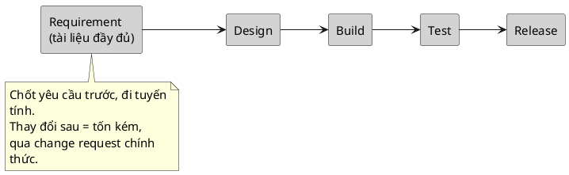
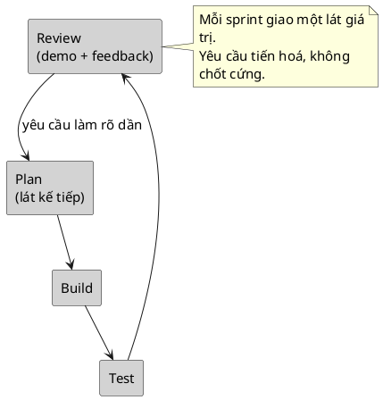

> Note này giúp BA điều chỉnh **cách làm việc và bộ tài liệu** theo mô hình dự án, thay vì áp một thói quen cố định. Trọng tâm không phải tranh luận mô hình nào tốt hơn — cả hai đều đúng trong context của nó — mà là nhận ra: thời điểm chốt yêu cầu, mức độ chi tiết tài liệu, và cách xử lý thay đổi sẽ khác nhau, và nếu BA làm sai mô hình thì tài liệu trở nên vô dụng.

## Note này dùng để làm gì

Mở note này khi:

- bạn vào một dự án mới và cần biết nên viết tài liệu kiểu nào, chi tiết tới đâu
- yêu cầu thay đổi liên tục và bạn phân vân có nên "chốt cứng" scope hay không
- team nói "mình làm Agile" nhưng vẫn bắt viết tài liệu đầy đủ trước, và bạn thấy mâu thuẫn

Đọc kèm:

- [Vai trò BA và vị trí trong dự án](/posts/foundations/ba-role-and-sdlc) — pha SDLC mà mô hình này sắp xếp lại
- [Hệ tài liệu BA phải biết](/posts/foundations/ba-documentation-types) — artifact tương ứng mỗi mô hình
- Agile concepts cho BA — chi tiết epic, story, backlog, sprint

Thuật ngữ nền (SDLC, Waterfall, Agile, backlog…) tra ở Glossary.

---

## 1. Mental model: chốt trước vs tiến hoá dần

Khác biệt gốc rễ nằm ở **khi nào yêu cầu được coi là "chốt"**.

Từ mental model này suy ra mọi khác biệt còn lại: nếu yêu cầu chốt trước, BA dồn công sức viết tài liệu chi tiết ở đầu; nếu yêu cầu tiến hoá, BA viết vừa đủ cho lát kế tiếp và làm rõ liên tục.

---

## 2. Tác động tới cách làm việc của BA

| Chiều | Waterfall | Agile |
|---|---|---|
| Thời điểm lấy & chốt requirement | gần như toàn bộ ở đầu | liên tục, theo từng sprint/lát |
| Mức độ chi tiết tài liệu một lần | cao, đầy đủ trước khi build | vừa đủ cho item sắp làm (just-in-time) |
| Artifact chính | BRD, SRS/FRS, Use Case đầy đủ | Epic, User Story, Acceptance Criteria, Product Backlog, PRD |
| Xử lý thay đổi | qua change request chính thức | đưa vào backlog, ưu tiên lại ở refinement |
| Nhịp làm việc của BA | theo cột mốc (milestone) | theo sprint; tham gia planning, refinement, review |
| Rủi ro đặc trưng | phát hiện hiểu sai quá muộn | tài liệu rời rạc, thiếu bức tranh tổng thể |

Điểm cần nhớ: Agile **không** có nghĩa là "không viết tài liệu". Nó có nghĩa là viết **đúng lúc và vừa đủ**, ưu tiên trao đổi trực tiếp, nhưng vẫn cần story, AC và đủ ngữ cảnh để dev và tester làm việc.

---

## 3. Phạm vi áp dụng — chọn theo context, không theo trào lưu

Đây là phần dễ sai nhất: chọn mô hình theo "đang mốt" thay vì theo bài toán. Không mô hình nào đúng tuyệt đối.

| Hợp với Waterfall khi | Hợp với Agile khi |
|---|---|
| scope rõ và ổn định từ đầu | yêu cầu còn mơ hồ, cần học từ phản hồi |
| ràng buộc hợp đồng/pháp lý buộc chốt trước | thị trường/người dùng thay đổi nhanh |
| môi trường compliance nặng (tài chính, y tế, chính phủ) cần truy vết & phê duyệt đầy đủ | cần đưa giá trị ra sớm, lặp nhanh |
| tích hợp phần cứng/bên thứ ba có lịch cứng | đội tự chủ, làm việc trực tiếp với người dùng |

Quy tắc thực dụng: để **bản chất bài toán và ràng buộc** chọn mô hình, không để sở thích đội chọn. Khi không chắc, hỏi: *yêu cầu sẽ ổn định hay còn thay đổi nhiều?* và *chi phí của một thay đổi muộn lớn tới đâu?*

---

## 4. Thực tế thường là hybrid

Phần lớn dự án thật không thuần Waterfall hay thuần Agile. Mô hình hay gặp ("Water-Scrum-Fall"): chốt khung yêu cầu & ngân sách ở đầu như Waterfall, nhưng phần build chạy theo sprint như Agile.

Hệ quả cho BA: thường vẫn phải **vừa** dựng một bộ tài liệu nền (SRS/Use Case ở mức khung) **vừa** vận hành backlog theo story. Đừng ngạc nhiên khi được yêu cầu cả hai — hãy hỏi rõ: cái gì cần chốt cứng trước, cái gì được phép tiến hoá theo sprint.

---

## 5. Anti-patterns

| Anti-pattern | Vì sao nguy hiểm | Cách sửa |
|---|---|---|
| Viết SRS 100 trang trước rồi mới làm, trong dự án Agile | tài liệu lỗi thời ngay khi yêu cầu đổi; lãng phí | viết vừa đủ cho lát kế tiếp, làm rõ dần |
| Coi "Agile = không cần tài liệu" | dev/tester thiếu ngữ cảnh, AC mơ hồ | vẫn cần story + AC + đủ rule để test |
| Chốt cứng scope đầu sprint rồi từ chối mọi thay đổi | đánh mất lợi thế thích nghi của Agile | đưa thay đổi vào backlog, ưu tiên lại |
| Bê nguyên quy trình change request nặng vào Agile | làm chậm vòng lặp, tạo quan liêu | thay đổi nhỏ xử lý qua refinement |
| Chọn mô hình theo trào lưu, không theo bài toán | sai nhịp với ràng buộc thật của dự án | chọn theo độ ổn định yêu cầu & chi phí thay đổi muộn |

---

## 6. Checklist nhanh

Khi vào dự án, xác định:

- Dự án theo mô hình nào — và **vì sao** lại chọn mô hình đó?
- Yêu cầu sẽ chốt cứng trước hay tiến hoá theo sprint?
- Bộ artifact đội thật sự đọc và dùng là gì (đừng viết tài liệu không ai đọc)?
- Một thay đổi yêu cầu sẽ đi đường nào: change request chính thức hay đưa vào backlog?
- Nếu là hybrid: phần nào chốt trước, phần nào được phép linh hoạt?

## References

- [Scrum Guide](https://scrumguides.org/) — định nghĩa chuẩn về khung Scrum (vai trò, sự kiện, artifact) cho phía Agile.
- [Atlassian Agile Coach](https://www.atlassian.com/agile) — so sánh thực hành Agile vs truyền thống ở mức dễ áp dụng.
- [IIBA BABOK overview](https://www.iiba.org/career-resources/a-business-analysis-professionals-foundation-for-success/babok/) — business analysis độc lập với phương pháp; nền để hiểu BA thích ứng ra sao theo mô hình.

## Internal Sources

- Các loại tài liệu BA — phần phân biệt truyền thống vs Agile
- Lesson note: tài liệu truyền thống vs Agile
- Study Map & Source Mapping

## Related

- [Vai trò BA và vị trí trong dự án](/posts/foundations/ba-role-and-sdlc)
- [Hệ tài liệu BA phải biết](/posts/foundations/ba-documentation-types)
- Agile concepts cho BA
- Change Request & Impact Analysis
- Glossary

