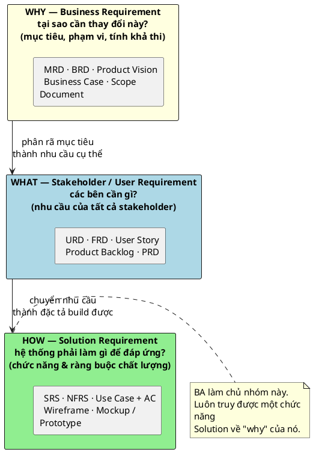

> Note này giúp BA định vị mọi loại tài liệu yêu cầu vào ba tầng — Business, Stakeholder, Solution — và biết với mỗi tầng thì ai viết, ai đọc, và BA tham gia tới đâu. Mục tiêu thực dụng: khi cần một thông tin, biết nó nằm ở tài liệu nào; khi cần viết, biết tài liệu nào là phần BA bắt buộc làm chủ và viết cho ai đọc.

## Note này dùng để làm gì

Mở note này khi:

- bạn onboard một dự án và cần biết những tài liệu nào đang tồn tại, nên đọc cái nào
- bạn phải tạo tài liệu nhưng phân vân viết loại gì, chi tiết tới đâu, cho ai
- bạn nghe các tên viết tắt (BRD, SRS, FRD, PRD, URD…) và muốn xếp chúng vào đúng chỗ

Đọc kèm:

- [Vai trò BA và vị trí trong dự án](/posts/foundations/ba-role-and-sdlc) — artifact gắn với từng pha SDLC
- [Agile vs Waterfall cho BA](/posts/foundations/agile-vs-waterfall-for-ba) — bộ tài liệu đổi theo mô hình
- Use Case cho BA và [BA Artifact Templates](/posts/templates/ba-artifact-templates) — phần Solution mà BA làm chủ

Tên tài liệu và viết tắt tra ở Glossary thay vì định nghĩa lại từng note.

---

## 1. Mental model: ba tầng trả lời ba câu hỏi

Mọi tài liệu yêu cầu thực chất trả lời một trong ba câu, đi từ trừu tượng xuống chi tiết:

Cách phân tầng này khớp với phân loại requirement của IIBA BABOK (business → stakeholder → solution). Quy tắc rút ra: **luôn truy được một dòng tài liệu Solution về "why" của nó**. Nếu không trả lời được tại sao một chức năng tồn tại, khả năng cao yêu cầu chưa được làm rõ ở tầng trên.

---

## 2. Ba nhóm tài liệu: ai viết, ai đọc, BA tham gia tới đâu

| Nhóm | Trả lời | Artifact tiêu biểu | Người viết chính | Người đọc | Mức tham gia của BA |
|---|---|---|---|---|---|
| **Business Requirement** | WHY | MRD, BRD, Product Vision, Business Case, Scope Document, Epic (mức cao) | PM/PO, Marketing/Sales, Sponsor, BOD | đội hoạch định, BA | **lấy thông tin** để lập kế hoạch; nhiều công ty BA không được xem nhóm này |
| **Stakeholder / User Requirement** | WHAT | URD, FRD, User Story, Product Backlog, PRD | PM/PO, đội sản phẩm, Sales/Marketing | đội sản phẩm, BA | **tham gia khai thác** yêu cầu |
| **Solution Requirement** | HOW | SRS, NFRS, Use Case + AC, Wireframe, Mockup/Prototype | **BA** | Developer, Tester/UAT, vận hành, CSKH | **viết và làm chủ** |

Hai điều thực tế đáng nhớ:

- Khối lượng và trách nhiệm cốt lõi của BA nằm ở **Solution Requirement** (định hình giải pháp), không phải ở tầm nhìn kinh doanh.
- Ở nhiều công ty, BA **không được tiếp cận** tài liệu Business Requirement (bảo mật/nội bộ). Khi đó BA phải khai thác ngược "why" qua phỏng vấn thay vì đọc tài liệu — đừng giả định luôn có sẵn.

---

## 3. Tài liệu đổi theo mô hình dự án

Cùng một tầng yêu cầu nhưng tên và hình thức tài liệu khác nhau giữa truyền thống và Agile (chi tiết ở [Agile vs Waterfall cho BA](/posts/foundations/agile-vs-waterfall-for-ba)):

- **Truyền thống / Waterfall:** thiên về BRD, SRS, FRS, Use Case đầy đủ, chốt trước khi build.
- **Agile:** thiên về Epic, Feature, User Story, Product Backlog, PRD — tiến hoá theo sprint.

Đừng máy móc dịch 1-1 giữa hai cột. Hỏi thẳng đội: tài liệu nào thực sự được đọc và dùng ở đây.

---

## 4. Phần BA bắt buộc làm chủ

Không cần (và không nên) cố viết mọi loại tài liệu. Trọng tâm thực hành cho BA mới, theo đúng định hướng khóa học, là làm chủ nhóm Solution:

- **SRS** — đặc tả yêu cầu phần mềm hoàn chỉnh.
- **Use Case + Acceptance Criteria** — chi tiết hoá cách hệ thống đáp ứng một nhu cầu đã nêu ở tầng Stakeholder (một use case thường là bản viết chi tiết cho một user story).
- **Wireframe** — bố cục và luồng màn hình.
- Giới thiệu **Epic và User Story** ở mức đủ dùng trong môi trường Agile.

### Wireframe vs Mockup/Prototype

Hay bị lẫn, nhưng mục đích khác nhau:

| | Wireframe | Mockup / Prototype |
|---|---|---|
| Tập trung | bố cục, luồng, vị trí thành phần | độ chân thực giao diện (UI), gần sản phẩm cuối |
| Bỏ qua | màu sắc, font, chi tiết thẩm mỹ | — |
| Dùng khi | thống nhất luồng & cấu trúc sớm | trình bày/kiểm thử cảm nhận giao diện |

---

### Running case: ShopFlow

Áp ba tầng cho dự án ShopFlow (Epic `SF-1`) để thấy mỗi tầng chứa gì:

| Tầng | Trả lời | Tài liệu/Artifact ShopFlow tương ứng |
|---|---|---|
| **Business (WHY)** | vì sao shop cần nền tảng này? | Epic `SF-1`: mục tiêu "chủ shop vận hành luồng bán hàng cơ bản, kiểm soát tồn kho, giảm rủi ro bán quá sẵn"; boundary "không tích hợp payment/shipper thật" |
| **Stakeholder (WHAT)** | các bên cần gì? | 8 User Story `SF-2..SF-9` (Browse catalog, Create order, Payment mock, Delivery status, Manage stock, Receive stock, Return, Low stock alert) — mỗi story gắn với một nhóm stakeholder |
| **Solution (HOW)** | hệ thống làm gì? | Domain model `SF-10` (Product, Customer, Order, OrderItem, Payment, InventoryItem, StockMovement, ReturnRequest), API contract `SF-36` (`GET /products` với stockStatus), Use Case + AC trong từng story |

Quy tắc "luôn truy về why" được kiểm chứng ngay: mỗi story Solution (`SF-3`) đều truy được ngược tới mục tiêu Business (giảm bán quá stock) — nếu một yêu cầu không truy được tới "why", khả năng cao là nó chưa thuộc tầng Solution hợp lệ. Chi tiết từng tầng và cách viết BRD/SRS cho ShopFlow nằm ở SRS và BRD cho BA.

---

## 5. Luôn bắt đầu bằng "Why"

Trước khi nhảy vào đặc tả chức năng, hỏi *tại sao cần yêu cầu này* để xác định mục tiêu và tính khả thi. Bỏ qua bước này là nguyên nhân phổ biến khiến BA viết một bộ Solution Requirement chi tiết nhưng giải sai bài toán.

Và luôn viết theo **audience**: Solution Requirement phải đủ rõ để Developer, Tester (UAT) và bộ phận vận hành đều đọc hiểu và triển khai được — không viết cho riêng mình.

---

## 6. Anti-patterns

| Anti-pattern | Vì sao nguy hiểm | Cách sửa |
|---|---|---|
| Nhảy thẳng vào SRS, bỏ qua "why" | đặc tả chi tiết cho một bài toán sai | làm rõ mục tiêu/why ở tầng Business trước |
| Lẫn lộn các tầng (coi BRD ≈ SRS) | trộn mục tiêu nghiệp vụ với chi tiết kỹ thuật, rối người đọc | giữ rạch ròi WHY / WHAT / HOW |
| Viết Solution Requirement chỉ mình hiểu | dev/tester/vận hành không dùng được | viết theo audience, kiểm bằng câu hỏi "ai sẽ đọc cái này" |
| Cố viết đủ mọi loại tài liệu | tốn công, nhiều tài liệu không ai đọc | tập trung nhóm Solution BA làm chủ |
| Giả định luôn có sẵn Business Requirement | nhiều nơi BA không được xem nhóm này | khai thác ngược "why" qua phỏng vấn |
| Dùng wireframe để chốt màu sắc/UI | sai mục đích công cụ, gây tranh cãi thẩm mỹ sớm | wireframe chốt luồng; để UI cho mockup |

---

## 7. Checklist nhanh

Trước khi coi việc chọn/viết tài liệu là xong:

- Tài liệu tôi cần thuộc tầng nào — Business (why), Stakeholder (what), hay Solution (how)?
- Ai viết chính tài liệu này, và tôi có quyền truy cập nguồn "why" không?
- Ai sẽ đọc tài liệu Solution của tôi — đã đủ rõ cho dev, tester, vận hành chưa?
- Dự án theo mô hình nào, nên tên/hình thức tài liệu là gì?
- Mỗi chức năng trong Solution có truy được về một mục tiêu ở tầng trên không?

## References

- [IIBA BABOK overview](https://www.iiba.org/career-resources/a-business-analysis-professionals-foundation-for-success/babok/) — phân loại requirement thành business / stakeholder / solution / transition; nền lý thuyết cho ba tầng ở note này.
- [Atlassian — Product requirements (PRD)](https://www.atlassian.com/agile/product-management/requirements) — cách viết PRD và yêu cầu sản phẩm trong môi trường Agile.

## Internal Sources

- Các loại tài liệu BA phải biết
- Lesson note: BA Documentation
- Study Map & Source Mapping

## Related

- [Vai trò BA và vị trí trong dự án](/posts/foundations/ba-role-and-sdlc)
- [Agile vs Waterfall cho BA](/posts/foundations/agile-vs-waterfall-for-ba)
- Use Case cho BA
- [BA Artifact Templates](/posts/templates/ba-artifact-templates)
- Glossary

