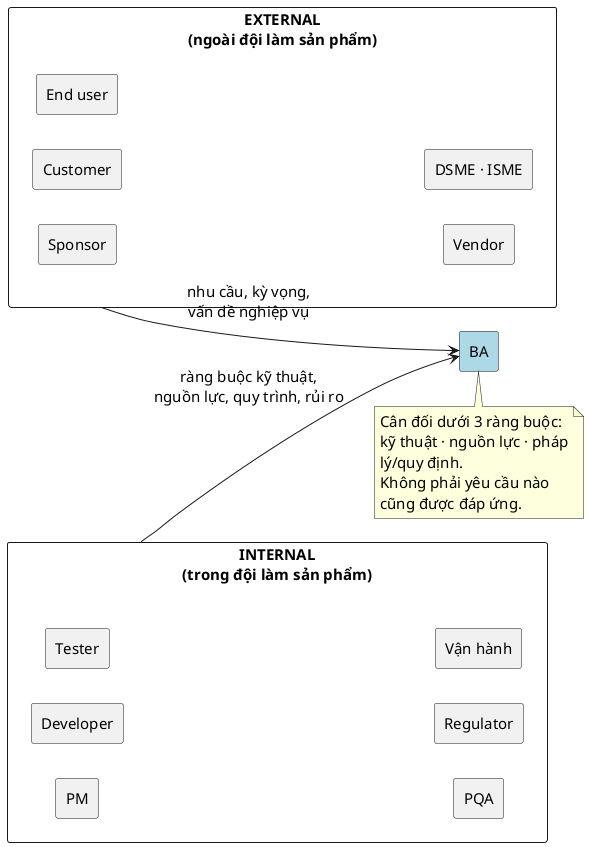
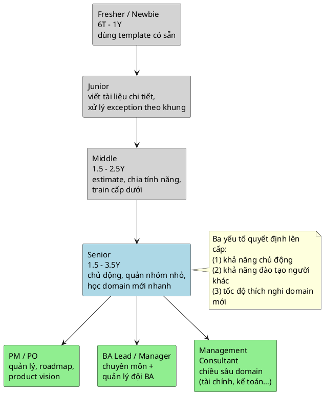

> Note này giúp bạn trả lời ba câu nền tảng khi bước vào nghề hoặc vào một dự án mới: BA thật sự làm gì, đứng ở đâu giữa các bên, và tham gia vào pha nào của vòng đời phát triển phần mềm với đầu ra là tài liệu gì. Mục tiêu không phải học thuộc định nghĩa, mà là biết mình kết nối ai, chịu trách nhiệm artifact nào, và khi nào được phép nói "không" với một yêu cầu.

## Note này dùng để làm gì

Mở note này khi:

- bạn mới vào nghề BA và còn mơ hồ "một ngày của BA làm gì"
- bạn vừa join một dự án và cần dựng nhanh bản đồ stakeholder để biết hỏi ai cái gì
- bạn cần biết ở pha hiện tại của dự án thì BA phải tạo ra tài liệu nào
- bạn đang phân vân lộ trình phát triển tiếp theo của mình

Đọc kèm:

- [Hệ tài liệu BA phải biết](/posts/foundations/ba-documentation-types) — artifact BA tạo ra ở từng pha
- [Agile vs Waterfall cho BA](/posts/foundations/agile-vs-waterfall-for-ba) — pha và artifact đổi theo mô hình dự án
- [Requirement Elicitation cho BA](/posts/discovery-and-requirements/requirement-elicitation) — kỹ thuật làm việc ở pha discovery

Thuật ngữ nền (BA, SDLC, stakeholder…) tra ở Glossary thay vì định nghĩa lại ở đây.

---

## 1. Mental model: BA là điểm cân đối, không phải cái loa

Hiểu sai phổ biến nhất là coi BA như người "chuyển lời" từ khách hàng sang dev. Thực tế BA đứng giữa hai phía có ngôn ngữ và lợi ích khác nhau, và **việc chính là cân đối**, không phải truyền đạt nguyên văn.

Hệ quả thực dụng: **không phải yêu cầu nào của khách cũng được đáp ứng**. Một yêu cầu hợp lý về nghiệp vụ vẫn có thể bị từ chối hoặc hoãn nếu vượt khả năng kỹ thuật, vượt nguồn lực, hoặc vi phạm quy định. Vai trò BA là làm cho cuộc đánh đổi đó *rõ ràng và có cơ sở*, chứ không phải gật đầu cho qua rồi đẩy áp lực sang dev.

---

## 2. Bản đồ stakeholder: vì sao phải chia External và Internal

Stakeholder là bất kỳ ai có lợi ích hoặc ảnh hưởng tới dự án. BA chia họ làm hai nhóm **vì cách giao tiếp và thứ cần lấy từ mỗi nhóm rất khác nhau** — không phải để phân biệt sang hèn.

| Nhóm | Ai | BA cần gì từ họ | Lưu ý giao tiếp |
|---|---|---|---|
| **External** | Sponsor (nhà đầu tư), Customer, End user, Vendor, DSME (chuyên gia nghiệp vụ), ISME (chuyên gia triển khai) | vấn đề thật, mục tiêu, kỳ vọng, ràng buộc nghiệp vụ/pháp lý | nói ngôn ngữ nghiệp vụ, tránh thuật ngữ kỹ thuật; xác nhận lại nhiều lần |
| **Internal** | PM, Developer, Tester, PQA (quản lý quy trình), Regulator (pháp chế), bộ phận vận hành | tính khả thi, estimate, rủi ro kỹ thuật, ràng buộc quy trình | nói cụ thể, có cấu trúc; gắn yêu cầu với rule và acceptance |

Dấu hiệu BA non tay: chỉ làm việc với một nhóm. Người mới hay quên **tester, PQA và vận hành** — đây chính là nhóm phát hiện sớm yêu cầu thiếu exception hoặc thiếu khả năng vận hành.

> Nhiều thuật ngữ viết tắt ở đây (DSME, ISME, PQA, Regulator…) xuất hiện trên slide khóa học nhưng chưa được giảng chi tiết. Khi cần định nghĩa chốt, bổ sung vào Glossary thay vì mỗi note giải thích một kiểu.

---

## 3. BA qua các pha SDLC: làm gì, ra artifact gì

SDLC (vòng đời phát triển phần mềm) là khung pha chung. BA không sở hữu toàn bộ vòng đời, nhưng có đầu vào/đầu ra rõ ở từng pha. Bảng dưới là mô hình tham chiếu; thứ tự và mức độ chồng lấn đổi theo mô hình dự án (xem [Agile vs Waterfall cho BA](/posts/foundations/agile-vs-waterfall-for-ba)).

| Pha | BA làm gì | Artifact đầu ra |
|---|---|---|
| Khởi tạo / Discovery | khơi gợi & làm rõ problem, goal, actor, rule | requirement đã làm rõ (xem [Elicitation](/posts/discovery-and-requirements/requirement-elicitation)) |
| Phân tích | cấu trúc hoá yêu cầu, phân rã chức năng, ưu tiên | FDD, MoSCoW, Use Case |
| Đặc tả | viết yêu cầu chi tiết cho đội phát triển | SRS, Use Case + AC (xem [Hệ tài liệu BA](/posts/foundations/ba-documentation-types)) |
| Thiết kế | phác bố cục & luồng màn hình | Wireframe / Mockup |
| Phát triển | làm rõ, trả lời câu hỏi dev, bảo vệ scope | Q&A, clarification, story & AC |
| Kiểm thử / UAT | hỗ trợ ca kiểm thử, nghiệm thu theo AC | tiêu chí nghiệm thu, hỗ trợ UAT |
| Vận hành / Thay đổi | phân tích yêu cầu thay đổi và ảnh hưởng | Change Request & Impact |

Đọc bảng theo chiều "đầu ra", không phải "đầu việc": ở mỗi pha hãy hỏi *artifact nào chứng minh BA đã hoàn thành phần của mình*.

---

## 4. Lộ trình phát triển (career path)

Lộ trình không cố định, phụ thuộc mục tiêu cá nhân và môi trường. Mốc thời gian dưới đây là **tham chiếu từ khóa học, không phải chuẩn tuyệt đối** — có người đi nhanh/chậm hơn.

| Cấp | Tham chiếu | Tự làm được gì |
|---|---|---|
| Fresher / Newbie | 6 tháng – 1 năm | dùng được template mô tả yêu cầu có sẵn; chưa tự thiết kế yêu cầu |
| Junior | — | viết tài liệu chi tiết, xử lý exception theo khung dựng sẵn; tự thiết kế chưa đầy đủ |
| Middle | 1.5 – 2.5 năm | estimate, tự chia nhỏ tính năng, train cấp dưới; phối hợp external có thể chưa cao |
| Senior | 1.5 – 3.5 năm | chủ động, estimate tốt, quản nhóm nhỏ (3–7), học domain mới nhanh |

Ba yếu tố quyết định lên cấp: **(1)** khả năng chủ động (estimate, thiết kế, xử lý ngoại lệ), **(2)** khả năng đào tạo người khác, **(3)** tốc độ thích nghi khi đổi domain.

Các hướng rẽ nhánh từ Middle/Senior:

- **PM / PO** — nặng kỹ năng quản lý, lập kế hoạch, product roadmap & vision.
- **BA Leadership / BA Manager** — chuyên môn nghiệp vụ + kỹ năng quản lý.
- **Management Consultant** — hiểu sâu một domain (tài chính, kế toán, giáo dục…) sau nhiều năm triển khai.

Điểm cốt lõi: muốn đi xa hơn vai trò "lấy và đặc tả yêu cầu", chỉ giỏi chuyên môn là chưa đủ — phải xây thêm bộ kỹ năng quản lý hoặc chiều sâu domain.

### Running case: ShopFlow

Dự án ShopFlow (Epic `SF-1`) minh hoạ stakeholder map và artifact SDLC rõ qua 3 role thực tế:

**Bản đồ stakeholder ShopFlow** (theo §2):

| Nhóm | Ai | Vai trò trong ShopFlow |
|---|---|---|
| **External** | Khách hàng | browse product + tạo order + payment mô phỏng (story `SF-2`, `SF-3`, `SF-4`) |
| | Chủ shop | theo dõi delivery, xử lý return, nhận alert low stock (story `SF-5`, `SF-8`, `SF-9`) |
| **Internal** | Nhân viên kho | quản lý stock, nhập hàng từ supplier, cập nhật delivery, xử lý return (story `SF-5`, `SF-6`, `SF-7`, `SF-8`) |
| | Developer / Tester | nhận AC từ mỗi story; QA scenarios riêng biệt (`SF-13`, `SF-16`, `SF-19`, `SF-39`, `SF-42`) |

Dấu hiệu "BA non tay" kiểm được: nếu BA chỉ làm việc với Chủ shop (external) mà quên Nhân viên kho (internal), các luồng nhập hàng (`SF-7`) và điều chỉnh stock (`SF-15`) sẽ thiếu pre-condition và exception → lộ ra muộn ở sprint sau.

**BA qua các pha SDLC trong ShopFlow** (theo §3):

| Pha | BA làm gì trong ShopFlow | Artifact đầu ra |
|---|---|---|
| Discovery | khơi gợi 8 luồng nghiệp vụ + 3 stakeholder từ Epic `SF-1` | requirement đã làm rõ, stakeholder register |
| Phân tích | chọn model cho từng câu hỏi: Use Case cho order flow, State Machine cho order status ("Pending Payment → Paid → Preparing → Shipped → Delivered") | Use Case Diagram, domain model `SF-10` |
| Đặc tả | viết story + AC cho `SF-2..SF-9`; mỗi story có scenario happy path + failure path; tồn kiểm tra stock validation `SF-11` atomic (reject toàn bộ order nếu thiếu) | User Story + AC, SRS-lite |
| Thiết kế | wireframe luồng checkout + catalog (Vue 3 + shadcn-vue `SF-38`, `SF-43`) | Wireframe catalog, order form |
| Kiểm thử / UAT | dựng QA scenario cho từng story (`SF-13`, `SF-16`, `SF-19`, `SF-39`, `SF-42`) | test case theo AC, UAT scenario |

Toàn bộ artifact này truy được ngược về Epic `SF-1`: shop cần vận hành luồng bán hàng + kiểm soát tồn kho — mỗi pha SDLC đều tạo ra một mảnh đặc tả để hiện thực mục tiêu đó.

---

## 5. Anti-patterns

| Anti-pattern | Vì sao nguy hiểm | Cách sửa |
|---|---|---|
| Nhận 100% yêu cầu khách rồi đẩy cho dev | bỏ qua ràng buộc kỹ thuật/nguồn lực/pháp lý, vỡ kế hoạch | làm rõ đánh đổi, ưu tiên, từ chối có cơ sở |
| Chỉ làm việc với một nhóm stakeholder | sót yêu cầu của tester/PQA/vận hành, lộ ra muộn | lập stakeholder map đủ cả external lẫn internal |
| Coi BA chỉ là "cầu nối truyền lời" | giữ nguyên mơ hồ, không tạo giá trị phân tích | cân đối và cấu trúc hoá, không chuyển nguyên văn |
| Xem BA là bước đệm dễ để lên PM | xem nhẹ chuyên môn, làm hời hợt | đầu tư kỹ năng phân tích & tài liệu trước |
| Không gắn việc mình làm với artifact đầu ra | khó chứng minh "đã xong" ở mỗi pha | mỗi pha chốt một artifact rõ ràng |

---

## 6. Checklist nhanh

Khi vào một dự án mới, BA nên trả lời được:

- Ai là stakeholder external, ai là internal? Tôi đã bỏ sót nhóm nào chưa (tester, PQA, vận hành)?
- Vấn đề nghiệp vụ thật mà dự án giải quyết là gì?
- Dự án đang ở pha nào, và artifact BA cần ra ở pha này là gì?
- Ba ràng buộc (kỹ thuật, nguồn lực, pháp lý) nào đang giới hạn việc đáp ứng yêu cầu?
- Yêu cầu nào tôi có thể phải từ chối hoặc hoãn, và lý do là gì?

Nếu chưa trả lời được, đừng vội cam kết phạm vi với bất kỳ bên nào.

## References

- [IIBA BABOK overview](https://www.iiba.org/career-resources/a-business-analysis-professionals-foundation-for-success/babok/) — khung kiến thức nền về vai trò và knowledge areas của business analysis.
- [Atlassian Agile Coach](https://www.atlassian.com/agile) — góc nhìn thực hành về vai trò BA/PO trong đội phát triển.

## Internal Sources

- Vai trò của BA trong dự án
- BA Career Path
- Lesson note: Vị trí của BA
- Lesson note: Career Path
- Study Map & Source Mapping

## Related

- [Hệ tài liệu BA phải biết](/posts/foundations/ba-documentation-types)
- [Agile vs Waterfall cho BA](/posts/foundations/agile-vs-waterfall-for-ba)
- [Requirement Elicitation cho BA](/posts/discovery-and-requirements/requirement-elicitation)
- Glossary

