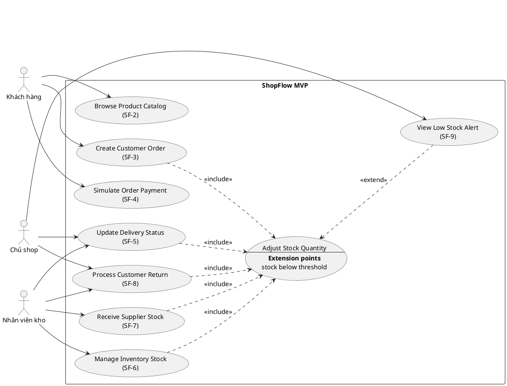
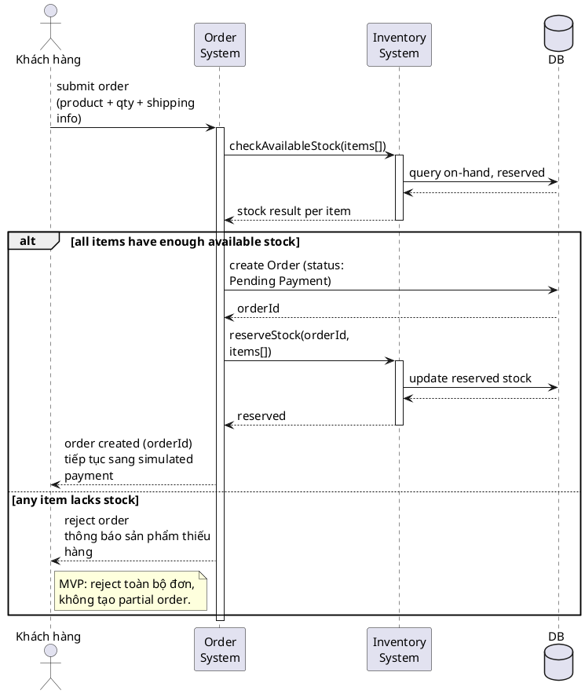

> Note này hướng dẫn BA dùng Use Case để mô tả các hành động và kịch bản cụ thể mà hệ thống phải xử lý khi phản hồi tác nhân. Trọng tâm không phải vẽ sơ đồ UML cho đúng ký hiệu, mà là mô tả đủ rõ ai làm gì, trong điều kiện nào, và hệ thống phản hồi ra sao — gồm cả luồng thường lẫn ngoại lệ.

## Note này dùng để làm gì

Mở note này khi bạn cần:

- mô tả một tính năng ở mức chi tiết hơn cây FDD: ai dùng, kích hoạt khi nào, kết quả gì
- xác định tác nhân (actor) và mục tiêu của một chức năng trước khi viết flow chi tiết
- đảm bảo đã bao quát cả normal case lẫn exception
- chuẩn bị đầu vào để viết luồng sự kiện chi tiết hoặc [User Story và AC](/posts/agile-delivery/user-story-and-acceptance-criteria)

Đọc kèm:

- FDD vs Use Case: chọn cái nào — khi nào dùng FDD, khi nào dùng Use Case
- Functional Decomposition Diagram (FDD) — thường làm trước Use Case để dựng overview
- [Requirement Elicitation cho BA](/posts/discovery-and-requirements/requirement-elicitation) — nguồn đầu vào cho actor, mục tiêu, kịch bản
- ShopFlow Online Shop Case Study cho BA — case xuyên suốt cho ví dụ bên dưới

---

## 1. Use Case là gì

Use Case là một kỹ thuật trong phân tích hệ thống dùng để **mô tả các hành động và kịch bản cụ thể**. Nó mô phỏng các tình huống thực tế mà hệ thống phải xử lý: hành động đầu vào của tác nhân, và phản hồi tương ứng của hệ thống.

Khác với FDD (nhìn hệ thống ở mức cây tính năng tổng thể), Use Case đi sâu vào **một tính năng cụ thể** và làm rõ cách tính năng đó vận hành khi có người dùng tương tác.

---

## 2. Năm bước xác định Use Case

### Bước 1: Xác định tác nhân (Actors)

Tác nhân là người hoặc đối tượng (hệ thống khác) tương tác với hệ thống của ta. Phân biệt hai nhóm:

| Nhóm | Ví dụ |
|---|---|
| **Tác nhân bên ngoài** | người dùng cuối (end users), hệ thống ngoài, đối tác (partners), người tiêu dùng dịch vụ, người giám sát, hệ thống tự động bên ngoài |
| **Tác nhân bên trong** | người dùng hệ thống (system users), quản trị viên (administrator), hệ thống tự động nội bộ, dịch vụ nội bộ, hệ thống cơ sở dữ liệu |

Xác định đúng actor giúp không sót người/hệ thống nào liên quan tới tính năng.

### Bước 2: Xác định mục tiêu (Objectives)

Mục tiêu giúp **giới hạn phạm vi** của tính năng: đảm bảo tập trung vào mục tiêu chính yếu, tránh lan man sang phần không liên quan. Nếu không chốt mục tiêu, Use Case dễ phình to và mô tả lẫn lộn nhiều chức năng.

### Bước 3: Xác định các hành động (Actions)

Bao gồm các sự kiện kích hoạt Use Case — thường gọi là **Trigger**. Trigger trả lời câu hỏi: điều gì làm kịch bản này bắt đầu?

### Bước 4: Xác định kịch bản (Scenarios)

Mỗi kịch bản cần làm rõ điều kiện đầu và điều kiện cuối:

| Thành phần | Ý nghĩa |
|---|---|
| **Pre-condition** (điều kiện tiên quyết) | điều kiện bắt buộc phải thỏa mãn để tính năng có thể bắt đầu |
| **Post-condition** (điều kiện hoàn thành) | kết quả mong đợi sau khi kịch bản kết thúc thành công |

### Bước 5: Mô tả chi tiết

Triển khai chi tiết các luồng sự kiện (main flow, alternative flow, exception flow). Phần luồng chi tiết thường được mô tả sâu hơn ở bước viết flow/đặc tả riêng.

---

## 3. Ví dụ Use Case theo ShopFlow

### Actor và Use Case tổng quan

| Actor | Use Case chính | Ghi chú |
|---|---|---|
| Khách hàng | Browse Product Catalog, Create Customer Order, Simulate Order Payment | bám Jira `SF-2`, `SF-3`, `SF-4` |
| Chủ shop | Update Delivery Status, Process Customer Return, View Low Stock Alert | bám Jira `SF-5`, `SF-8`, `SF-9` |
| Nhân viên kho | Manage Inventory Stock, Receive Supplier Stock, Update Delivery Status, Process Customer Return | bám Jira `SF-5`, `SF-6`, `SF-7`, `SF-8` |

---

## 3a. Quan hệ Include và Extend giữa các Use Case

Ngoài quan hệ actor–use case (association), UML Use Case Diagram còn hai loại quan hệ **giữa các use case với nhau**: `<<include>>` và `<<extend>>`. Cả hai đều mô tả hành vi xảy ra **trong cùng một lần thực thi** — khác với quan hệ tuần tự theo thời gian (xem thêm ở mục Anti-patterns).

### Include — hành vi bắt buộc, dùng chung

`<<include>>` dùng khi một use case **luôn luôn** gọi một use case khác tại một điểm cố định trong flow của nó. Included use case không tồn tại độc lập — nó chỉ là một đoạn hành vi được tách ra vì nhiều use case cha cùng dùng chung, tránh lặp lại mô tả.

**Ví dụ trong ShopFlow:**

Ba use case `Manage Inventory Stock` (SF-6), `Receive Supplier Stock` (SF-7), `Process Customer Return` (SF-8) — dù trigger khác nhau (chỉnh tay / nhập hàng / khách trả hàng) — đều kết thúc bằng cùng một hành động: **ghi nhận số lượng tồn kho mới vào DB**. Đây là ứng viên include chuẩn: tách hành động đó ra thành một use case riêng tên `Adjust Stock Quantity`, và cả ba use case cha đều include nó.

```text
UC5 (Manage Inventory Stock)   ..> Adjust Stock Quantity : <<include>>
UC6 (Receive Supplier Stock)   ..> Adjust Stock Quantity : <<include>>
UC7 (Process Customer Return)  ..> Adjust Stock Quantity : <<include>>
```

Đặc điểm nhận biết include: nếu bỏ use case con ra, use case cha **không còn hoàn chỉnh** — `Manage Inventory Stock` mà không ghi được vào DB thì coi như không làm được gì.

### Extend — hành vi tùy chọn, có điều kiện

`<<extend>>` dùng khi một use case chèn thêm hành vi bổ sung vào một use case khác, **chỉ khi thỏa điều kiện nhất định**, tại một điểm gọi là **extension point**. Khác với include, base use case vẫn **hoàn chỉnh và tự đứng được một mình** kể cả khi không có extending use case.

**Ví dụ trong ShopFlow:**

Sau khi `Adjust Stock Quantity` chạy xong (dù được gọi từ UC5, UC6 hay UC7), hệ thống kiểm tra: nếu số lượng tồn kho rơi xuống dưới ngưỡng cấu hình, thì mới chèn thêm `View Low Stock Alert` (SF-9). Nếu không dưới ngưỡng, `Adjust Stock Quantity` vẫn coi là hoàn tất bình thường — không cần alert.

```text
Adjust Stock Quantity <.. View Low Stock Alert : <<extend>>
                                                  (extension point: stock below threshold)
```

### Diagram đầy đủ



> **Lưu ý về PlantUML:** `extension point` trong oval `Adjust Stock Quantity` được
> dựng bằng Creole formatting (`---` tạo đường kẻ ngăn cách, `<b>` in đậm),
> không phải một construct UML chuyên biệt mà PlantUML hiểu về mặt ngữ nghĩa.
> Đây chỉ là mẹo trình bày cho giống chuẩn UML; PlantUML không có keyword riêng
> cho extension point như `<<include>>` hay `<<extend>>`.

### Bảng so sánh nhanh

| Tiêu chí | Include | Extend |
|---|---|---|
| Base case cần con không? | Bắt buộc — không hoàn chỉnh nếu thiếu | Không — vẫn hoàn chỉnh dù thiếu |
| Điều kiện thực thi | Luôn luôn xảy ra | Chỉ khi thỏa điều kiện tại extension point |
| Vị trí trong flow | Cố định, xác định trước | Điểm rẽ nhánh tùy chọn |
| Ví dụ ShopFlow | UC5/UC6/UC7 include `Adjust Stock Quantity` | `Adjust Stock Quantity` extend bởi `View Low Stock Alert` |

### Lưu ý về actor khi dùng extend

Actor chính của `View Low Stock Alert` là **Chủ shop**, nhưng use case gốc `Adjust Stock Quantity` lại được kích hoạt bởi actor khác nhau tùy use case cha (Nhân viên kho hoặc Chủ shop). Đây là quan hệ extend do **hệ thống tự kích hoạt** (system-triggered) sau khi điều kiện thỏa mãn, không phải actor chủ động gọi. UML không bắt buộc extend phải cùng actor với base case — chỉ cần base case tự hoàn chỉnh độc lập là đủ điều kiện.

### Mini-glossary bổ sung

- **Include:** quan hệ use case bắt buộc — base case luôn gọi included use case tại một điểm xác định trong flow.
- **Extend:** quan hệ use case tùy chọn — extending use case chèn thêm hành vi vào base case tại extension point, chỉ khi điều kiện thỏa mãn.
- **Extension point:** vị trí cụ thể trong flow của base use case, nơi một extend use case có thể được chèn vào.

---

### Use Case mẫu: UC-ORD-001 Create Customer Order

| Thành phần | Nội dung |
|---|---|
| Use Case ID | `UC-ORD-001` |
| Primary actor | Khách hàng |
| Goal | tạo order từ sản phẩm còn available stock |
| Trigger | khách submit order từ danh sách sản phẩm đã chọn |
| Pre-condition | sản phẩm active; khách đã nhập thông tin giao hàng hợp lệ |
| Post-condition thành công | order được tạo ở status `Pending Payment`; stock được reserve |
| Post-condition thất bại | không tạo order; inventory không đổi |
| Requirement/Jira | `FR-ORD-001`, `SF-3`, `SF-11` |

**Main flow**

1. Khách hàng chọn sản phẩm và số lượng.
2. Khách hàng nhập thông tin giao hàng.
3. Khách hàng submit order.
4. Hệ thống kiểm available stock cho từng order item.
5. Hệ thống tạo order ở status `Pending Payment`.
6. Hệ thống reserve stock theo quantity của từng item.
7. Hệ thống chuyển khách hàng sang bước thanh toán mô phỏng.

**Exception flow**

| Điều kiện | Hệ thống phản hồi |
|---|---|
| Một item không đủ available stock | reject toàn bộ order và hiển thị thông báo thiếu hàng |
| Thông tin giao hàng thiếu hoặc sai format | không tạo order và yêu cầu khách sửa dữ liệu |
| Sản phẩm không còn active | không tạo order và báo sản phẩm không còn bán |

**Main flow sequence diagram**



Use Case này nối được sang:

- User Story: `Create customer order`
- SRS requirement: `FR-ORD-001`
- RTM dòng `FR-ORD-001`
- UAT scenario: `UAT-ORD-001`

---

## 4. Lưu ý quan trọng khi viết Use Case

1. **Tập trung vào người dùng:** luôn lấy tác nhân tương tác làm trung tâm của kịch bản, không mô tả theo góc nhìn kỹ thuật nội bộ.
2. **Phân tích đủ luồng:** bao quát cả **normal case** (luồng thành công) lẫn **exception** (lỗi hoặc luồng rẽ nhánh). Đây là chỗ Use Case tạo giá trị rõ nhất so với mô tả tính năng chung chung.
3. **Mô tả rành mạch:** mọi tình huống diễn đạt rõ để đội phát triển không hiểu nhầm.
4. **Cập nhật thường xuyên:** Use Case là **tài liệu sống**, cần cập nhật theo thay đổi của yêu cầu hoặc hệ thống — giống nguyên tắc tài liệu sống của FDD.

---

## 5. Anti-patterns

| Anti-pattern | Vì sao nguy hiểm | Cách sửa |
|---|---|---|
| Chỉ mô tả happy path | sót lỗi, rẽ nhánh, edge case | liệt kê đủ normal case + exception |
| Không chốt mục tiêu trước | Use Case phình to, lẫn nhiều chức năng | xác định objective ở Bước 2 để giới hạn scope |
| Bỏ qua pre/post-condition | không rõ khi nào được bắt đầu, khi nào coi là xong | ghi rõ pre-condition và post-condition |
| Mô tả theo góc nhìn hệ thống | khó kiểm chứng theo hành vi người dùng | viết theo tác nhân: actor làm gì, hệ thống phản hồi gì |
| Vẽ dependency (`.>`) giữa các use case để thể hiện thứ tự thời gian | include/extend/dependency chỉ đúng cho quan hệ trong cùng 1 lần thực thi, không phải trình tự nghiệp vụ theo state | chuyển sang pre-condition trong Use Case Spec hoặc State Machine Diagram của entity |
| Viết một lần rồi để yên | Use Case lệch khỏi hệ thống thật | coi là tài liệu sống, cập nhật theo thay đổi |

---

## 6. Checklist nhanh

Trước khi coi một Use Case là đủ dùng, kiểm tra:

- Đã xác định đủ actor (cả bên trong và bên ngoài) chưa?
- Mục tiêu của tính năng có rõ và đủ hẹp không?
- Trigger nào làm kịch bản bắt đầu?
- Pre-condition và post-condition đã ghi rõ chưa?
- Đã có cả normal case lẫn exception chưa?
- Mô tả có đủ rõ để Dev/QA không hiểu nhầm không?

---

## Mini-glossary

- **Use Case:** kịch bản sử dụng — kỹ thuật mô tả tương tác giữa hệ thống và tác nhân.
- **Actor:** tác nhân (người hoặc hệ thống) tương tác với phần mềm.
- **Trigger:** sự kiện kích hoạt một kịch bản.
- **Pre-condition:** điều kiện tiên quyết để kịch bản bắt đầu.
- **Post-condition / Expected Result:** điều kiện hoàn thành / kết quả mong đợi.
- **Normal case:** luồng xử lý thông thường (thành công).
- **Exception:** trường hợp ngoại lệ (lỗi hoặc luồng rẽ nhánh).
- **UML:** Unified Modeling Language — ngôn ngữ mô hình hóa dùng để vẽ sơ đồ Use Case.

## References

- [IIBA BABOK overview](https://www.iiba.org/career-resources/a-business-analysis-professionals-foundation-for-success/babok/) — nền tảng business analysis, bao gồm use case và scenario modeling.
- [Use case (Wikipedia)](https://en.wikipedia.org/wiki/Use_case) — định nghĩa chuẩn về use case, actor, scenario.
- [UML use case diagram (Wikipedia)](https://en.wikipedia.org/wiki/Use_case_diagram) — ký hiệu sơ đồ use case trong UML.

## Internal Sources

- UML Use Case sample
- FDD sample
- Study Map & Source Mapping

> Nguồn gốc: tổng hợp từ video bài giảng "Usecase và So sánh Usecase với FDD". Danh sách actor và 5 bước bám theo cách trình bày trong bài; chi tiết luồng sự kiện (main/alternative/exception flow) thuộc bài học sau, chưa khai triển ở đây.

## Related

- FDD vs Use Case: chọn cái nào
- Functional Decomposition Diagram (FDD)
- [User Story và Acceptance Criteria cho BA](/posts/agile-delivery/user-story-and-acceptance-criteria)
- [Requirement Elicitation cho BA](/posts/discovery-and-requirements/requirement-elicitation)
- ShopFlow Online Shop Case Study cho BA

